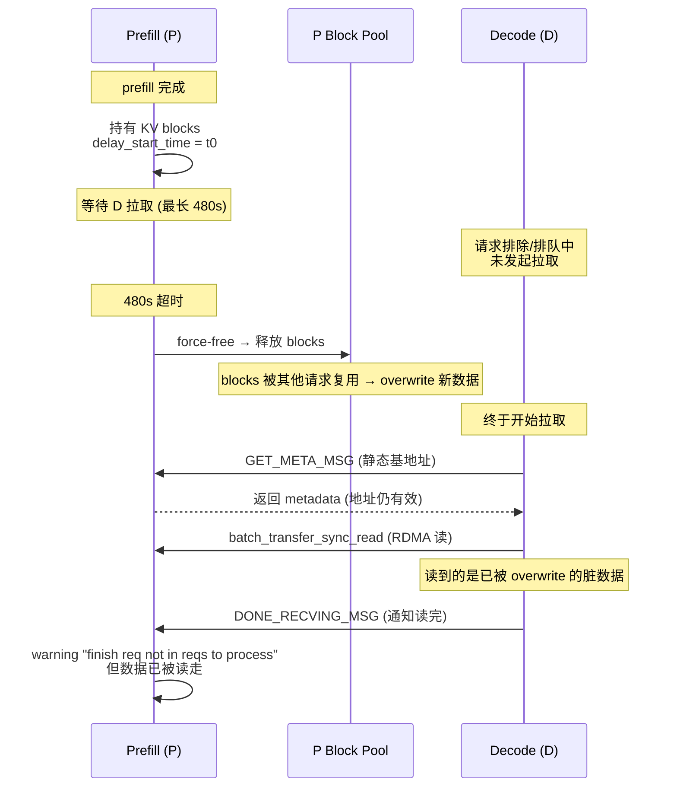
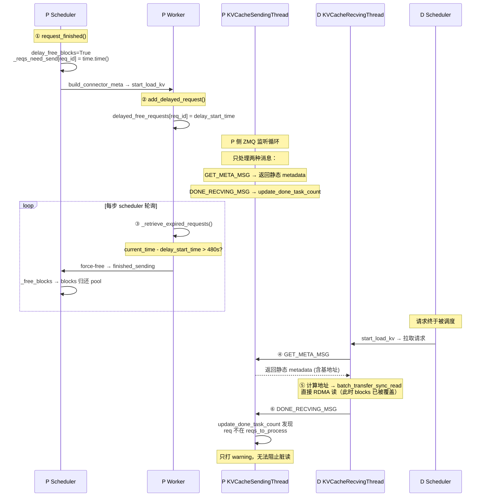
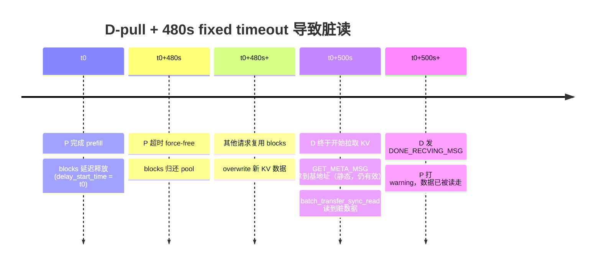
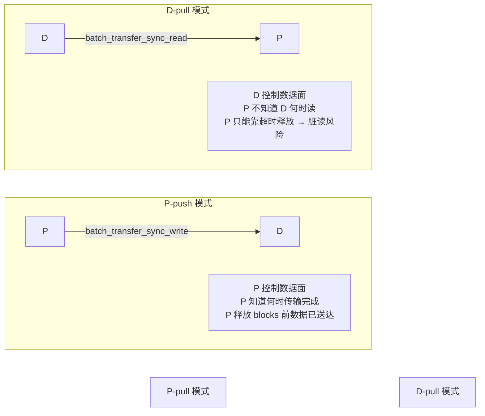
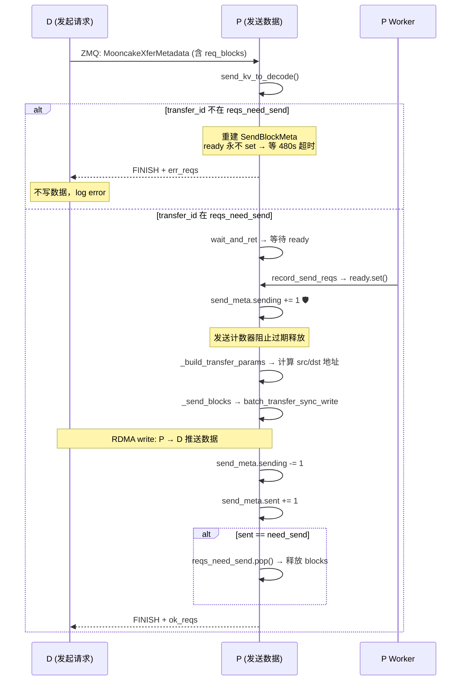
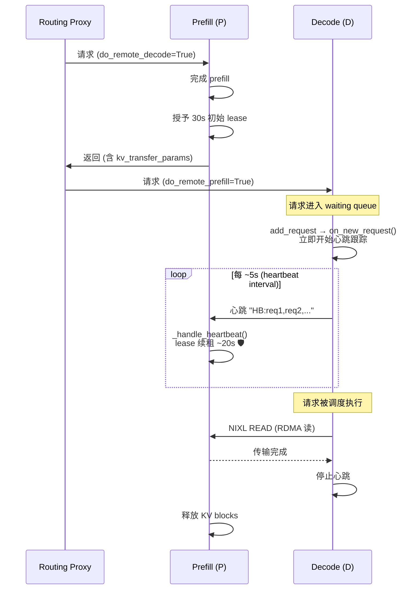
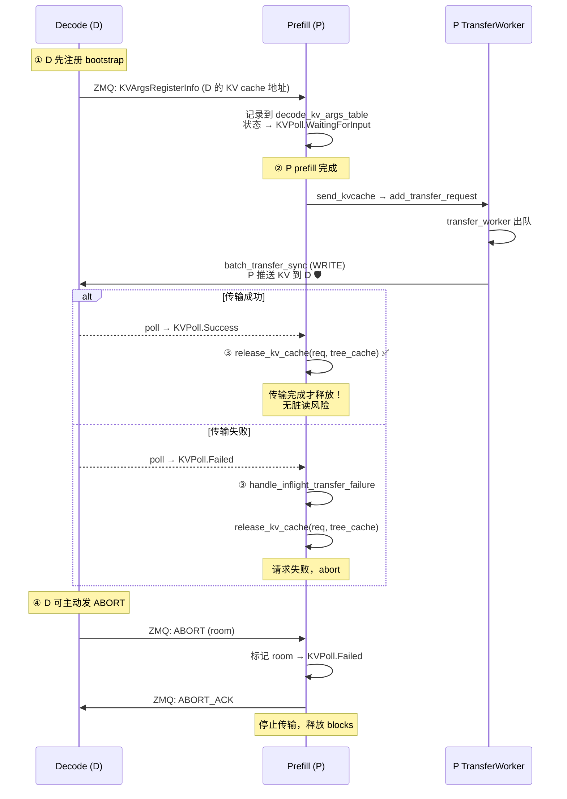
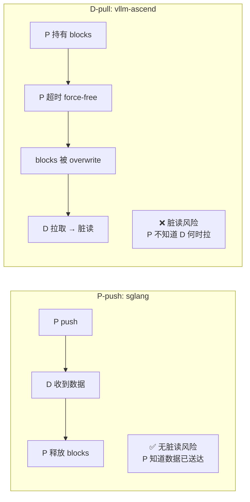
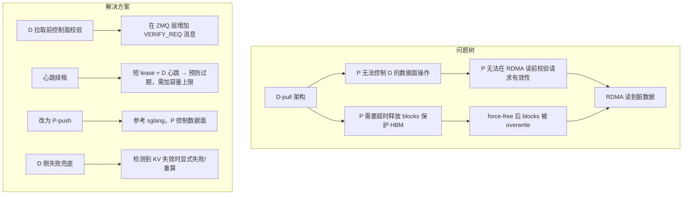
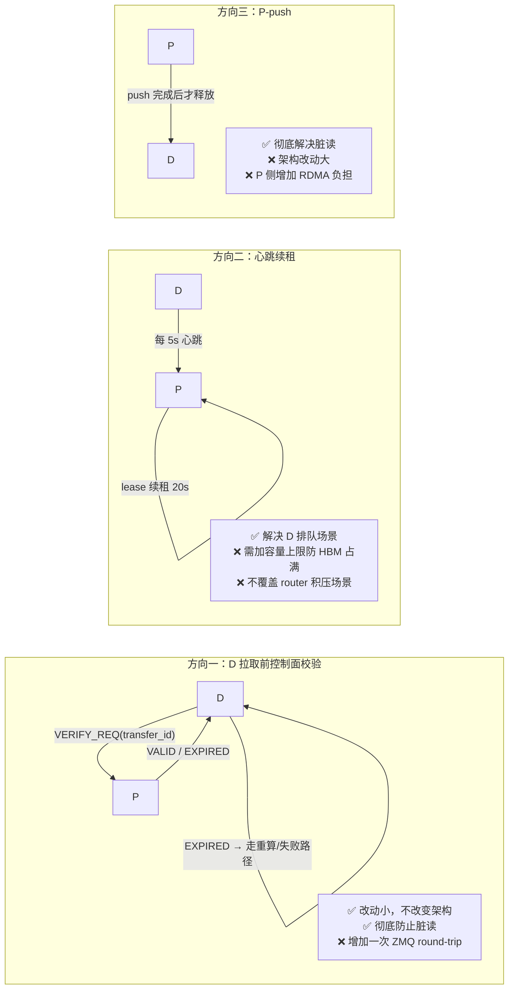

# PD 分离场景下 KV Cache 超时释放导致 D 节点读到脏 KV 的问题分析

> 版本基线：vLLM v0.23.0 / vLLM-Ascend v0.23.0（MoonCake connector）
> 关联 issue：[vllm-project/vllm-ascend#15420](https://github.com/vllm-project/vllm-ascend/issues/15420)
> 本文档整理自代码分析、上游设计文档与官方 issue 调研，供后续修复参考。

---

## 1. 问题现象

在 PD（Prefill/Decode）分离部署场景下（MoonCake connector，`MooncakeConnectorV1`）：

1. P 节点完成 prefill 后，持有 KV cache blocks，等待 D 节点拉取，最长持有 `VLLM_MOONCAKE_ABORT_REQUEST_TIMEOUT`（默认 480s）；
2. 当 D 节点上请求排除（preempt）很多，未能在超时时间内拉取对应 KV；
3. P 节点超时后 **force-free**（强制释放）这些 blocks，归还 block pool；
4. blocks 被后续新请求复用并写入新数据（overwrite）；
5. D 节点之后才发起拉取，通过 RDMA 从 P 的**物理地址**读到的已经是其他请求的 KV 数据（脏 KV）；
6. D 节点用脏 KV 继续 decode，输出乱码。

> 关键点：超时释放是 P 侧**单方面**的内存保护机制，与 D 侧的 RDMA 拉取之间**没有任何协调或校验屏障**。

---

## 2. 根因分析

### 2.1 vllm-ascend `MooncakeConnectorV1` 架构

### 2.2 触发链路（代码位置）

涉及文件：`vllm_ascend/distributed/kv_transfer/kv_p2p/mooncake_connector.py`

| 步骤 | 位置 | 说明 |
|------|------|------|
| ① 延迟释放 | `MooncakeConnectorScheduler.request_finished()` (L1880) | prefill 完成（`FINISHED_LENGTH_CAPPED`）→ 返回 `delay_free_blocks=True`，记录 `_reqs_need_send[req_id] = time.time()` |
| ② 记录到期时间 | `KVCacheTaskTracker.add_delayed_request()` (L215) | worker 侧把请求放入 `delayed_free_requests`（OrderedDict，记录 delay_start_time） |
| ③ 超时 force-free | `KVCacheTaskTracker._retrieve_expired_requests()` (L221) | 每步轮询：`current_time - delay_start_time > VLLM_MOONCAKE_ABORT_REQUEST_TIMEOUT` 则弹出并返回为 finished → scheduler `_free_blocks` → blocks 归还 pool |
| ④ 无校验的元数据应答 | `KVCacheSendingThread.run_busy_loop()` (L322) | P 侧监听 ZMQ，只处理 `GET_META_MSG`（返回静态 `MooncakeAgentMetadata`，含 KV cache 基地址/stride）和 `DONE_RECVING_MSG`（`update_done_task_count`），**没有任何 per-request 有效性校验** |
| ⑤ D 侧无感知直读 | `KVCacheRecvingThread._transfer_kv_cache_all_groups()` (L774) | D 用 P 的基地址 + block_id 计算物理地址，直接 `engine.batch_transfer_sync_read()` (L962) 从 P 的设备内存 RDMA 读 |
| ⑥ 事后告警 | `update_done_task_count()` (L187) | D 拉取完成后发 `DONE_RECVING_MSG`，P 发现 req 已不在 `reqs_to_process`，只打 warning：`"MooncakeConnector finish req not in reqs to process"` |

### 2.3 三个关键缺陷

1. **P 侧发送线程没有任何 per-request 校验**：`GET_META_MSG` 返回的是静态注册元数据（KV cache 基地址、block stride 等），与具体请求是否过期无关。D 拿到地址后自行计算物理地址，P 无法拦截。

2. **D 侧 RDMA 读是 address-based 的 one-sided 操作**：数据面（RDMA read）与控制面（ZMQ 元数据/通知）分离。P 对数据面没有任何控制权，无法阻止 D 在 blocks 释放后仍发起读。

3. **force-free 后 blocks 立即归还 pool 可被复用**：`_retrieve_expired_requests()` 把请求从 `delayed_free_requests` 弹出并标记为 finished → scheduler `_free_blocks` → `kv_cache_manager.free()` → 后续新请求可分配这些 blocks 并 overwrite。

### 2.4 时间线

---

## 3. D-pull vs P-push 架构对比

### 3.1 核心区别

### 3.2 传输方向矩阵

| Connector | 方向 | 传输调用 | 数据面控制方 | P 侧保护机制 |
|-----------|------|---------|-------------|-------------|
| **vLLM 上游 MooncakeConnector** | **P-push** | `batch_transfer_sync_write` (L1365) | P | `sending` 计数器 + 发送前二次校验 |
| **vLLM 上游 NixlConnector** | **D-pull** | NIXL READ (`_read_blocks`) | D | lease + 心跳续租（预防性，无硬校验） |
| **vllm-ascend MooncakeConnectorV1** | **D-pull** | `batch_transfer_sync_read` (L962) | D | **无**（仅 480s 固定超时 force-free） |
| **vllm-ascend MooncakeHybridConnector** | **D-pull** | `batch_transfer_sync_read` | D | **无**（同 V1） |
| **vllm-ascend MooncakeLayerwiseConnector** | **P-push** | `batch_transfer_sync_write` (L497, L1908) | P | 逐层同步推送，`request_finished` 返回 `False, None`（不需要延迟释放） |
| **sglang Mooncake** | **P-push** | `batch_transfer_sync` (WRITE 默认) | P | 传输完成后才 `release_kv_cache` + ABORT 双向信道 |

### 3.3 上游 vLLM MooncakeConnector（P-push + sending 计数器保护）

- **数据流向**：D 发 ZMQ 请求给 P → P 的 `send_kv_to_decode` (L1003) 等待 ready → `batch_transfer_sync_write` (L1365) 把 P 的 KV 推到 D 的内存。
- **`sending` 计数器保护**（L1100 / L1477）：发送前 `send_meta.sending += 1`；`fetch_finished_sending_reqs` (L1465) 只对 `sending == 0` 的请求做超时过期。正在发送的请求不会被过期释放。
- **发送前二次校验**（L1098）：ready 后检查 `transfer_id in self.reqs_need_send`，已过期则丢弃（`"Request %s expired before sending on P side"`），不发送数据。
- **结论**：P-push 让 P 控制数据面，可以拦截过期请求，不存在"D 读到已被覆盖的数据"的问题。

### 3.4 上游 vLLM NixlConnector（D-pull + lease renewal 心跳）

- **数据流向**：D 侧 `_read_blocks_for_req` → `_read_blocks` 发起 NIXL READ，从 P 拉取。
- **lease 续租机制**（设计文档 `docs/design/nixl_kv_cache_lease.md`）：
  - P 完成 prefill → 授予短初始 lease（默认 30s）；
  - D 的 scheduler 在 `add_request` → `on_new_request` (scheduler.py L1821) 时**立即开始**心跳跟踪（请求进入 waiting queue 即开始，而非被调度执行时）；
  - D 每 `lease_duration // 6`（约 5s）发心跳 `"HB:req1,req2,..."`，P 的 `_handle_heartbeat` (worker.py L1847) 用 `max(old, new_expiry)` 续租约 20s；
  - 传输完成或请求结束 → `_stop_heartbeat` 停止心跳。
- **解决的目标**：
  - D 崩溃 → 心跳停止 → P 秒级回收（而不是等 480s）；
  - D 过载排队 → 心跳持续续租 → blocks 存活，D 最终能读到正确数据。
- **局限**：
  - 心跳**只覆盖"请求已到达 D 且 D 的 forward loop 在运行"的场景**；若请求在 router/proxy 积压 500s 才到 D，D 根本不知道请求存在，无法发心跳，lease 过期后同样会脏读；
  - lease 只增不减（`max(old, new_expiry)`），**没有容量上限/拒绝续租机制**：若 D 长期不处理，P 的 HBM 会被"死"请求占满；
  - D-pull 数据面无校验：P 收到 D 的读完成通知时（`_get_new_notifs` L1792）才发现请求已过期，但 RDMA 读已经发生，P 只打 `"Potentially invalid KV blocks"` 警告，无法阻止脏读。

### 3.5 vllm-ascend LayerwiseConnector（P-push）

- 逐层传输：P 计算完一层立即 push 一层（`batch_transfer_sync_write`），不需要延迟释放 blocks（注释：`# layer_wise push, not need delay_free_blocks`，L1111/L1123）。
- 生命周期短、P 控制数据面，不存在"D 拉取已释放 blocks"的问题。

---

## 4. sglang 的做法（P-push + 传输完成才释放 + ABORT 信道）

涉及文件：`~/code/python/sglang/python/sglang/srt/disaggregation/`

### 4.1 核心流程

### 4.2 关键代码

1. **D 先注册（bootstrap）**：D 通过 ZMQ 把 KV cache 地址（`KVArgsRegisterInfo`）发给 P，P 记录到 `decode_kv_args_table` / `transfer_infos`（conn.py `start_prefill_thread` L2006），状态置为 `KVPoll.WaitingForInput`。**P 知道写到哪里**。
2. **P push**：P 完成 prefill → `send_kvcache` / `_send_kvcache_generic` (conn.py L645) → `transfer_worker` (L1645) → `batch_transfer_sync` (L641，WRITE 默认) 把 P 的 KV 推到 D。
3. **传输完成后才释放**：P 轮询 `MooncakeKVSender.poll()` (L2399)，`poll == KVPoll.Success` → `release_kv_cache(req, self.tree_cache)`（prefill.py L932）；`poll == KVPoll.Failed` → `handle_inflight_transfer_failure`（L983）→ 同样 `release_kv_cache`（L1003）。**P 侧不会在传输完成前释放 blocks。**
4. **超时只标记失败，不 force-free**：`_check_bootstrap_timeout` / `_check_waiting_timeout`（common/conn.py L1320 / L1595）只把请求状态置为 Failed 并走失败路径，不会"释放 blocks 让 D 事后读到脏数据"。

### 4.3 其他机制

- **ABORT 双向信道**：D 可发 `ABORT` 消息给 P（`start_prefill_thread` L2022），P 将房间标记为 `KVPoll.Failed` 并回 `ABORT_ACK`；配合 `enable_deferred_decode_kv_release` 在 worker 排空 in-flight 写后 ACK，避免 D 取消后 P 继续 push。
- **Session 探测**：`_failed_session_probe_loop` (L2303) 定期 `send_probe` 探测失败 session 是否恢复。
- **心跳**：`_on_heartbeat_success` (L2269) 用于 session 级健康检查（非请求级 lease 续租）。

### 4.4 为什么 sglang 没有脏读问题

- **P 控制数据面**：push 完成 = D 已收到数据 → P 才释放 blocks。不存在"D 在 blocks 释放后发读"的窗口。
- **失败显式传播**：传输失败 → 请求 Failed → abort，不会继续用未初始化的 KV decode。
- **代价**：P 侧需要主动 push（占用 P 的 RDMA 资源与计算时间）；D 必须先注册（bootstrap 多一次 round-trip）。

---

## 5. 官方 issue / PR 调研

### 5.1 vllm-ascend

| # | 状态 | 内容 |
|---|------|------|
| [15420](https://github.com/vllm-project/vllm-ascend/issues/15420) | open | **本问题**：GLM5.2 PD 分离，KV 超时释放后 D 节点拉取到脏 KV 导致乱码（复现：`VLLM_MOONCAKE_ABORT_REQUEST_TIMEOUT=10` + P/D 加压）。日志时间线与本文档 §2.4 完全一致。 |
| [14716](https://github.com/vllm-project/vllm-ascend/pulls/14716) (PR) | open | Prefill abort side-channel：让 load-balance proxy 通知 P force-release 资源（新增 `ABORT_REQUEST_MSG`）。解决"D 取消后 P 白占内存"，不解决"D 仍在排队但超时"的脏读。 |
| [2899](https://github.com/vllm-project/vllm-ascend/pulls/2899) (PR) | merged | Mooncake timeout release bug fix：修复 req_id 双重释放（D 通知释放 + scheduler 超时释放）。 |
| [6570](https://github.com/vllm-project/vllm-ascend/issues/6570) | closed | `"MooncakeConnector finish req not in reqs to process"` 告警的早期 issue。 |
| [7140](https://github.com/vllm-project/vllm-ascend/issues/7140) | open | mooncake_connector 超时误用 NIXL 配置项（配置层问题）。 |

其他 PD 分离乱码 issue（根因各不相同，多为多病因）：#14085（glm-5.2 910B 偶现乱码/重复）、#12792（dsv4pro A2 8 机）、#15402（MinimaxM2.5 Layerwise，怀疑 `event.synchronize()` 乱序）、#9679（kimi-k2.5）、#14545（P/D blocksize 配置不一致）。

### 5.2 vllm 上游

| # | 状态 | 内容 |
|---|------|------|
| [41383](https://github.com/vllm-project/vllm/pull/41383) / [43099](https://github.com/vllm-project/vllm/pull/43099) | closed | NixlConnector lease renewal TTL KV blocks on P（心跳续租的落地 PR + 设计文档 PR）。 |
| [52627](https://github.com/vllm-project/vllm/issues/52627) | open | Kimi-K3 NIXL Direct-PD silent output corruption：**纯 NIXL（无 Mooncake）持续高并发也能复现**，说明 silent corruption 是 D-pull 架构的普遍问题。 |
| [52234](https://github.com/vllm-project/vllm/issues/52234) | open | NIXL HMA receive failures 可返回 HTTP 200 + corrupted tokens："KV 加载失败但请求不失败"的共性问题。 |
| [48633](https://github.com/vllm-project/vllm/issues/48633) | open | `NixlPushMode` (WRITE) Roadmap：上游把 P-push 作为演进方向；P0 项包含 **C1（D abort 后 P 仍 WRITE 到已释放 blocks → silent corruption）**、L1（单向心跳 + 静态 480s TTL，无闭环终止）。 |
| [50425](https://github.com/vllm-project/vllm/issues/50425) | open | Mooncake：D 侧 client disconnect 不释放 P 的 prefill KV cache（反向问题：P 内存被白占）。 |

---

## 6. 结论与修复方向

### 6.1 结论

1. **根因**：vllm-ascend `MooncakeConnectorV1` 的 D-pull 架构 + 固定 480s 超时 force-free，P 侧数据面无校验，导致 D 在 blocks 释放并被覆盖后仍能通过 RDMA 读到脏数据。
2. **架构差异是根本**：P-push（上游 Mooncake、vllm-ascend Layerwise、sglang）让 P 控制数据面，天然可以拦截过期请求；D-pull（NixlConnector、vllm-ascend MooncakeConnectorV1）让 D 控制数据面，P 只能事后感知。
3. **心跳续租（NixlConnector）能缓解但不能根治**：只覆盖"D 已收到请求但排队"场景；对"请求 500s 才到 D"与"HBM 被占满"两个场景无效；且 D-pull 数据面仍无硬校验。

### 6.2 候选修复方向

1. **D 拉取前控制面校验（推荐，改动小）**：在 `run_busy_loop` 中新增消息类型（如 `VERIFY_REQ`），D 在 `batch_transfer_sync_read` 前先问 P "该请求 blocks 是否仍有效"；P 检查 `task_tracker.reqs_to_process`；若已 force-free 则返回 EXPIRED，D 走重算/失败路径。代价：每次拉取多一次 ZMQ round-trip。

2. **心跳续租（参考 NixlConnector）**：P 侧延迟释放改为"短 lease + D 心跳续租"，解决"D 过载排队导致 blocks 提前释放"；需补充容量上限（拒绝续租/强制淘汰）避免 P 的 HBM 被占满。

3. **传输完成后释放（参考 sglang）**：若架构允许，改为 P-push 或至少保证"P 释放 blocks 前 D 已确认完成读"。

4. **D 侧失败兜底**：参考上游 #52234 的教训，确保"KV 加载失败/过期"时请求显式失败或重算，而不是用未初始化/脏 KV 继续 decode。