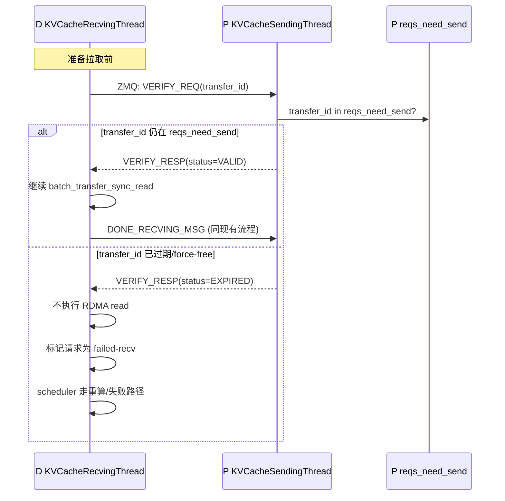
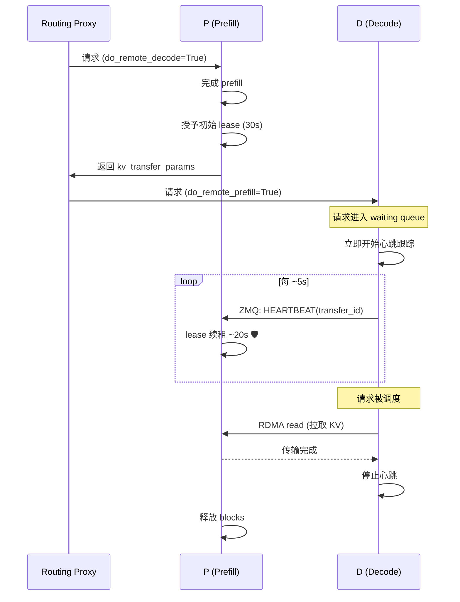
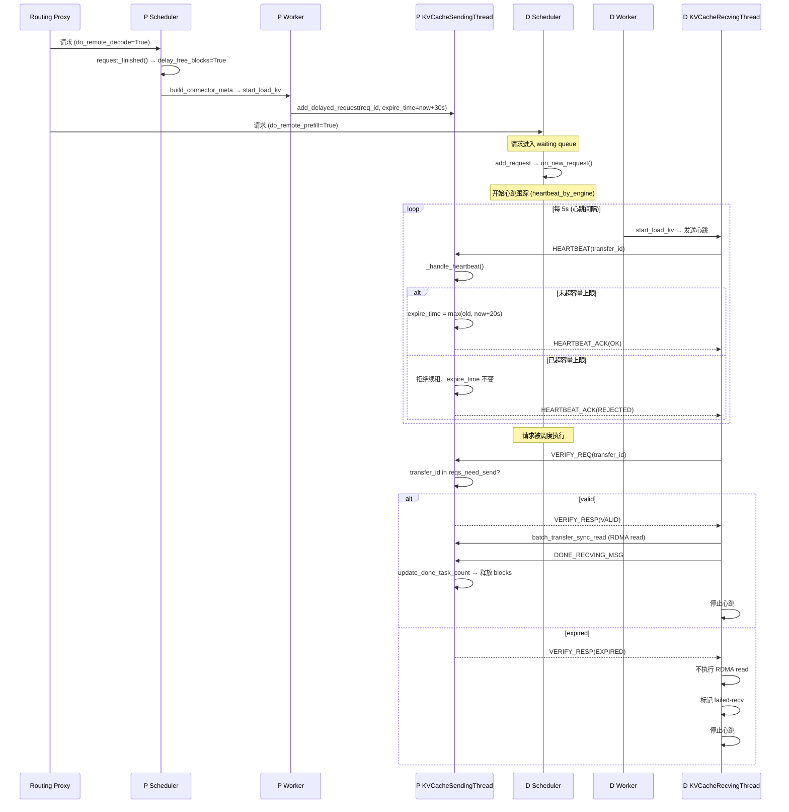
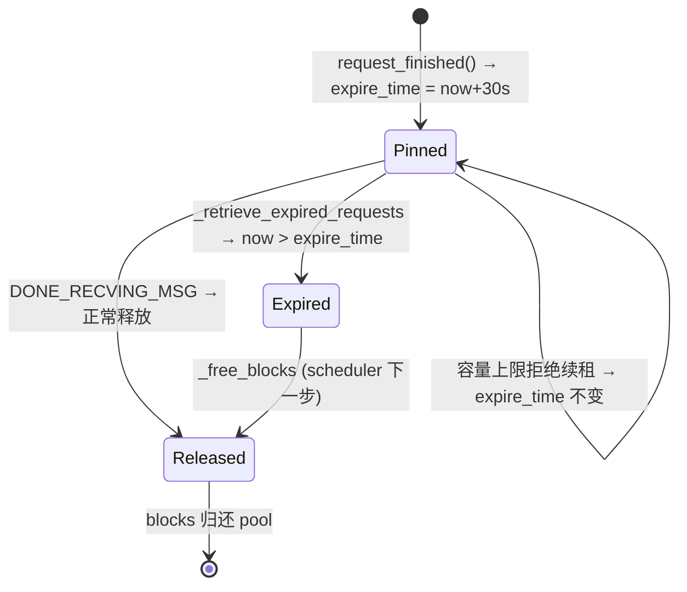
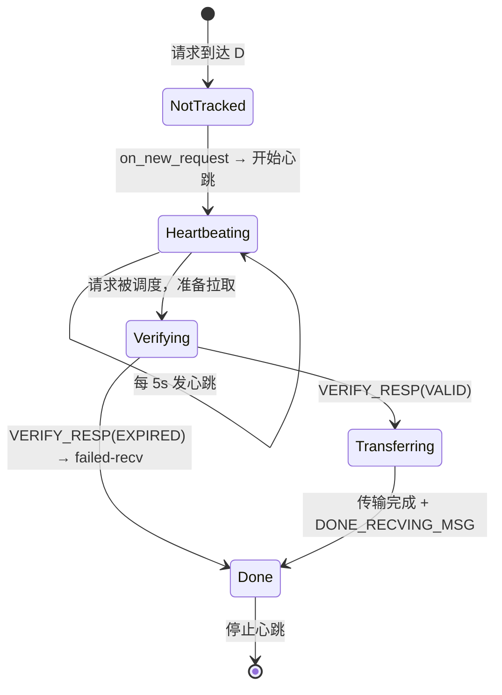
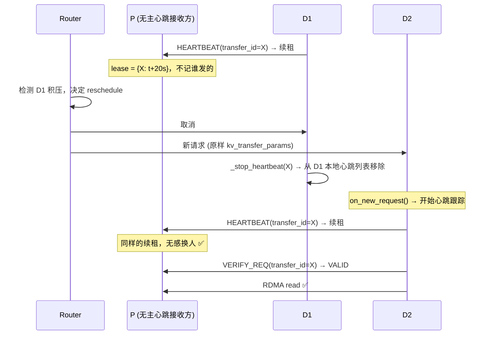
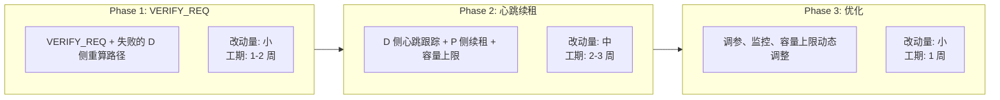
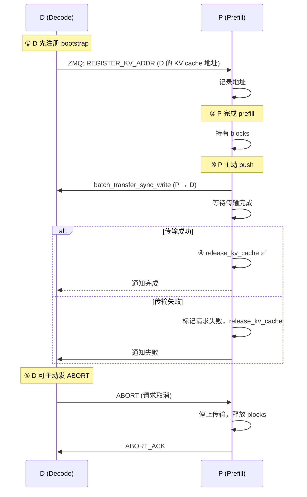
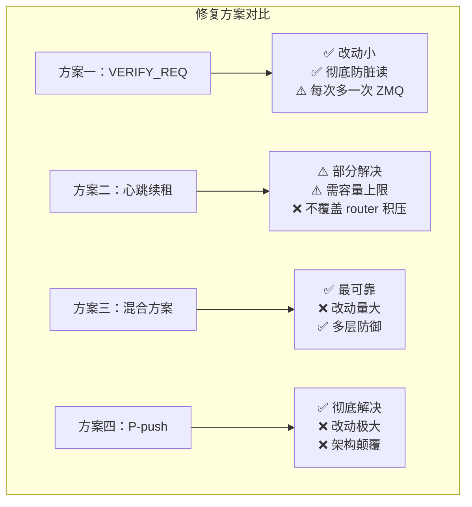

# PD 分离场景 KV 脏读问题 — 修复方案评估

> 基于 `vllm-ascend` `MooncakeConnectorV1`（v0.23.0）设计
> 关联 bug：[#15420](https://github.com/vllm-project/vllm-ascend/issues/15420)

---

## 问题回顾

P 节点完成 prefill 后持有 KV blocks，最长 480s（`VLLM_MOONCAKE_ABORT_REQUEST_TIMEOUT`）。若 D 节点因请求排除/排队未在超时内拉取，P 侧 force-free 释放 blocks，blocks 被后续请求复用 overwrite。D 之后用 P 的静态注册地址直接 RDMA read，读到已被覆盖的数据 → 乱码。

**根因**：D-pull 架构下，数据面（RDMA read）与控制面（ZMQ 元数据/通知）分离，P 无法在数据面拦截过期请求。

---

## 方案一：拉取前控制面校验（VERIFY_REQ）

### 原理

D 在 `batch_transfer_sync_read` 之前，先通过 ZMQ 向 P 发送一条 `VERIFY_REQ(transfer_id)` 消息，P 检查该请求的 blocks 是否仍有效（即 `transfer_id` 是否还在 `reqs_need_send` 或 `task_tracker.reqs_to_process` 中），返回 VALID 或 EXPIRED。D 根据结果决定是否继续拉取。

### 协议设计



### 代码改动

**P 侧（`KVCacheSendingThread.run_busy_loop`）**：

```python
# 新增消息类型
VERIFY_REQ_MSG = b"verify_req_msg"

# 在 run_busy_loop 的 if-elif 链中增加
elif msg[0] == VERIFY_REQ_MSG:
    transfer_id = msg[1].decode("utf-8")
    is_valid = transfer_id in self.reqs_need_send
    resp = b"VALID" if is_valid else b"EXPIRED"
    sock.send_multipart((identity, b"", resp))
```

**D 侧（`KVCacheRecvingThread._transfer_kv_cache_all_groups` 前）**：

```python
# 在 _handle_request 或 _transfer_kv_cache_all_groups 开头
def _verify_request(self, remote_host, remote_handshake_port, transfer_id) -> bool:
    """拉取前验证请求是否仍有效"""
    sock = self._get_remote_socket(remote_host, remote_handshake_port)
    payload = self.encoder.encode((VERIFY_REQ_MSG, transfer_id))
    ensure_zmq_send(sock, payload, f"{remote_host}:{remote_handshake_port}")
    resp = ensure_zmq_recv(sock, f"{remote_host}:{remote_handshake_port}")
    self._return_remote_socket(sock, remote_host, remote_handshake_port)
    return resp == b"VALID"
```

### 评估

| 维度 | 评价 |
|------|------|
| **可靠性** | ✅ 彻底防止脏读：验证通过才读，不通过就走失败路径 |
| **改动量** | ✅ 小：P 侧加一条消息处理、D 侧加一个 verify 调用 |
| **架构影响** | ✅ 无：不改变 D-pull 架构，不改变现有数据流 |
| **性能影响** | ⚠️ 每次拉取多一次 ZMQ round-trip（~100μs–1ms，相对 RDMA 传输的几十 ms 可忽略） |
| **竞态窗口** | ✅ 极小：VERIFY 和 RDMA read 之间 P 可能 force-free？但 force-free 后 `reqs_need_send` 中已无该 transfer_id，verify 会返回 EXPIRED |
| **失败路径** | 需配合 D 侧 scheduler 的 `failed-recv` 处理（已有 `get_block_ids_with_load_errors` 和 `_update_requests_with_invalid_blocks` 机制，但需确认当前是否走重算路径） |

---

## 方案二：心跳续租（Lease Renewal）

### 原理

参考上游 NixlConnector 的 lease renewal 机制。P 将固定 480s 超时改为短初始 lease（如 30s），D 在请求排队期间持续发送心跳给 P 续租。D 崩溃或完成传输后停止心跳，P 快速回收 blocks。



### 代码改动

**P 侧**：
- `_retrieve_expired_requests`：改为检查 `expire_time < now`（而非 `current_time - delay_start_time > 480s`）
- `run_busy_loop`：新增 `HEARTBEAT_MSG` 处理，续租时 `expire_time = max(old, now + lease_extension)`
- 容量上限：`delayed_free_requests` 超过阈值时拒绝续租

**D 侧**：
- scheduler 侧：`on_new_request` 钩子记录需心跳的请求（类似 NixlConnector 的 `_heartbeat_by_engine`）
- worker 侧：`start_load_kv` 中发送心跳消息
- 心跳间隔：`lease_duration // 6`（约 5s）

### 评估

| 维度 | 评价 |
|------|------|
| **可靠性** | ⚠️ 部分解决：D 存活时心跳续租，blocks 存活；但若请求 500s 才到 D（router 积压），D 无法发心跳，lease 过期后同方案一需要兜底 |
| **改动量** | ⚠️ 中：需新增 D 侧 scheduler 心跳跟踪、P 侧心跳处理、容量上限机制 |
| **架构影响** | ✅ 无：不改变 D-pull 架构 |
| **性能影响** | ✅ 小：心跳每 5s 一次，开销可忽略 |
| **HBM 风险** | ❌ 需新增容量上限：D 持续发心跳时 P 的 blocks 会无限期钉住，需在 P 侧拒绝续租或强制淘汰 |
| **与 bug 的关系** | 只能预防"D 排队但 blocks 过期"的场景，不能覆盖"请求未到 D"的场景，且 D-pull 数据面仍无硬校验 |

---

## 方案三：混合方案（VERIFY_REQ + 短超时 + 心跳）—— 详细设计

### 为什么是这三种机制的组合

| 层 | 机制 | 解决的问题 | 覆盖场景 |
|----|------|-----------|---------|
| **L1** | 心跳续租（短 lease 30s + D 每 5s 心跳） | D 正常排队时 blocks 持续存活，D 崩溃时秒级回收 | ✅ D 存活但排队<br>✅ D 崩溃/失联 |
| **L2** | 拉取前 VERIFY_REQ | 兜底：心跳失效/lease 过期后防止脏读 | ✅ 心跳因网络分区丢失<br>✅ 请求 500s 才到 D（router 积压）<br>✅ 任何其他原因导致 lease 过期 |
| **L3** | 容量上限（pinned block 硬上限） | 防止 P 的 HBM 被无限钉住 | ✅ D 长期不处理<br>✅ 恶意过量请求 |

### 协议设计

#### 消息类型总览

| 消息 | 方向 | 触发时机 | 内容 |
|------|------|---------|------|
| `HEARTBEAT_MSG` | D → P | 每 ~5s（请求排队期间） | `(transfer_id)` |
| `HEARTBEAT_ACK` | P → D | 收到心跳后 | `(status)` 其中 status=OK 或 REJECTED |
| `VERIFY_REQ_MSG` | D → P | 每次 batch_transfer_sync_read 之前 | `(transfer_id)` |
| `VERIFY_RESP_MSG` | P → D | 收到验证请求后 | `(status)` 其中 status=VALID 或 EXPIRED |
| `DONE_RECVING_MSG` | D → P | 拉取完成后 | 沿用现有 |

#### 传输通道选型（调研结论）

##### 当前 vllm-ascend 的 ZMQ 控制面消息

`MooncakeConnectorV1`（D-pull）目前只有 2 种 ZMQ 消息：

| 消息 | 方向 | 内容 | 触发时机 |
|------|------|------|---------|
| `GET_META_MSG` | D → P | `(GET_META_MSG, "")` | D 首次连接 P 时 |
| `DONE_RECVING_MSG` | D → P | `(DONE_RECVING_MSG, request_id, remote_port_send_num)` | D 拉取完成后 |

`MooncakeLayerwiseConnector`（P-push）多 2 种完成通知：

| 消息 | 方向 | 说明 |
|------|------|------|
| `DONE_SENDING_MSG` | D → P | D 接收完成 |
| `FAILED_SENDING_MSG` | D → P | D 接收失败 |

控制面极其轻量，加 3 种新消息（HEARTBEAT、VERIFY_REQ/RESP）从 2 种变 5 种，协议仍然非常简单。

##### 候选通道对比（代码调研结论）

对心跳/验证消息的传输通道，调研了四种候选：

| 通道 | 底层协议 | 连接方式 | 消息格式 | 是否适合心跳 |
|------|---------|---------|---------|-------------|
| **ZMQ**（推荐） | TCP | 持久连接（ROUTER/DEALER） | msgpack 二进制 | ✅ 现有控制面，改动最小 |
| **HIXL `SendNotify` / `GetNotifies`** | RDMA（HIXL 引擎） | 复用已建立的 HIXL 连接 | `NotifyDesc {name, msg}` | ⚠️ 可用但需改 Mooncake 绑定层 |
| **NIXL `send_notif` / `get_new_notifs`** | IB/RoCE（fallback TCP） | 复用 NIXL agent 连接 | 二进制 | ✅ NixlConnector 采用（vllm-ascend 未用） |
| **Mooncake `sendNotify` / `getNotifies`** | TCP Socket | **每次新建连接**（connect+send+close） | JSON | ❌ 开销大，不适合周期性心跳 |

##### 各通道调研细节

**① ZMQ（推荐）**
- 现有 `KVCacheSendingThread.run_busy_loop` 就是 ZMQ ROUTER，新增消息类型只需在 if-elif 链加分支；
- 持久连接复用，无连接建立开销；
- 独立 TCP 通道，与 RDMA 数据面分离：心跳衡量的是"D 的 forward loop 是否在跑"，而不是 RDMA 链路状态。

**② HIXL `SendNotify` / `GetNotifies`（`~/code/cpp/hixl/include/hixl/hixl.h` L163-170）**
- HIXL 是 Ascend 上的底层通信库（类似 NIXL），确实提供了与 NIXL `send_notif` 对应的通知能力：
  ```cpp
  Status SendNotify(const AscendString &remote_engine,
                    const NotifyDesc &notify, int32_t timeout_in_millis = 1000);
  Status GetNotifies(std::vector<NotifyDesc> &notifies);
  struct NotifyDesc { AscendString name; AscendString notify_msg; };
  ```
- Mooncake 的 `AscendDirectTransport`（TENT 实现）已通过 HIXL `Connect` 建立了 P/D 之间的 HIXL 连接，理论上可复用；
- **但 Mooncake 的 Python 绑定层（`transfer_engine_py.cpp`）没有暴露 `SendNotify` / `GetNotifies`**——只为 `TransferAsync` 等做了绑定。要用需修改 Mooncake 的 C++ 绑定层，增加依赖和复杂度，为一个心跳不值得。

**③ NIXL `send_notif` / `get_new_notifs`（上游 NixlConnector 采用）**
- 心跳复用 NIXL 的 notification 系统，走已建立的 agent 连接（IB/RoCE RDMA，自动 fallback 到 TCP）；
- 上游设计文档明确：*"heartbeats reuse NIXL's existing notification system (send_notif / get_new_notifs). The notification medium is backend-specific, with automatic fallback from IB/RoCE to TCP already handled by NIXL."*
- vllm-ascend 的 MooncakeConnectorV1 没有 NIXL 依赖，不适用。

**④ Mooncake `sendNotify` / `getNotifies`（`~/code/cpp/Mooncake/.../transfer_metadata_plugin.cpp`）**
- 底层走 `SocketHandShakePlugin::doSendNotify`（L1124-1163）：每次 notify 都 **`doConnect` 新建 TCP 连接 → `writeString` 发 JSON → `readString` 收响应 → `close` 关闭连接**；
- 无连接复用、JSON 序列化开销大，适合低频元数据交换（握手），**不适合每 5s 一次的心跳**。

##### 心跳负载分析（为什么 ZMQ 不会太重）

关键：心跳**不是 per-request 的，是 per-P-node batch 的**（参考 NixlConnector `_send_heartbeats`：按 `remote_engine_id` 分组，同一 P 节点的所有请求合并成一条 `"HB:req1,req2,..."` 消息）。

| 场景 | 请求数 | P 节点数 | 每条心跳大小 | 频率 | ZMQ 总负载 |
|------|--------|---------|-------------|------|-----------|
| 正常 | 100 | 2 | 50×36B≈1.8KB | 2条/5s | 0.7KB/s |
| 高压 | 1000 | 4 | 250×36B≈9KB | 4条/5s | 7.2KB/s |
| 极端 | 10000 | 1 | 10000×36B≈360KB | 1条/5s | 72KB/s |

对比：现有 `GET_META_MSG` 返回的 `MooncakeAgentMetadata` 单条就是几百 KB。心跳（几十 B ~ 几百 KB 极端情况）每 5s 一条，对 ZMQ/TCP 完全可忽略。

##### 结论

**心跳和 VERIFY_REQ 走 ZMQ，是唯一合理的选择**：现有控制面就是 ZMQ（改动最小）、持久连接、与 RDMA 数据面分离。HIXL 的 `SendNotify` 虽可用但需改 Mooncake 绑定层，Mooncake 自带 notify 每次新建 TCP 连接不适合周期性心跳。

#### 完整时序



### 状态机

#### P 侧：每个延迟释放请求的状态



#### D 侧：每个请求的心跳跟踪



### 容量上限策略

#### 设计目标

P 的 HBM 中被"延迟释放"钉住的 blocks 不超过一个可配置的硬上限，防止 D 大量积压时 P 的可用 blocks 被耗尽。

#### 实现方案

**P 侧 `KVCacheTaskTracker` 新增容量跟踪**：

```python
class KVCacheTaskTracker:
    def __init__(self, ...):
        ...
        self.pinned_block_count: int = 0          # 当前被钉住的 block 总数
        self.max_pinned_ratio: float = 0.5        # 默认：最多 50% 的 pool 可被钉住
        self.total_blocks: int = 0                # P 的 block pool 总数（从 kv_cache_config 获取）

    def add_delayed_request(self, request_id, expire_time, num_blocks):
        """延迟释放一个请求，如果容量不足则拒绝"""
        with self.done_task_lock:
            if self.pinned_block_count + num_blocks > self.total_blocks * self.max_pinned_ratio:
                # 超过容量上限，拒绝延迟释放
                logger.warning("Pinned block limit reached, forcing immediate release")
                return False  # 不延迟释放，直接允许 scheduler 释放 blocks
            self.delayed_free_requests[request_id] = expire_time
            self.pinned_block_count += num_blocks
            return True

    def release_blocks(self, request_id, num_blocks):
        """释放被钉住的 blocks"""
        with self.done_task_lock:
            self.pinned_block_count -= num_blocks
            self.delayed_free_requests.pop(request_id, None)

    def can_accept_heartbeat(self, num_blocks):
        """心跳续租时检查容量"""
        return self.pinned_block_count + num_blocks <= self.total_blocks * self.max_pinned_ratio
```

#### 超容量后的行为

| 场景 | 行为 |
|------|------|
| `add_delayed_request` 时超容量 | 不延迟释放，直接释放 blocks → D 后续拉取时 VERIFY_REQ 返回 EXPIRED → D 走 failed-recv |
| 心跳续租时超容量 | `HEARTBEAT_ACK(REJECTED)` → D 收到后应尽快拉取，否则 lease 过期后走 VERIFY_REQ 兜底 |
| 正常续租不超过容量 | 正常续租，不做限制 |

### 代码改动清单

#### 文件：`mooncake_connector.py`

| 位置 | 改动 |
|------|------|
| `KVCacheTaskTracker.__init__` (L167) | 新增 `pinned_block_count`、`max_pinned_ratio`、`total_blocks` |
| `KVCacheTaskTracker.add_delayed_request` (L215) | 改为接受 `expire_time` + `num_blocks`，加入容量检查 |
| `KVCacheTaskTracker._retrieve_expired_requests` (L221) | 改为比较 `expire_time < now`（而非 `time.time() - delay_start_time > 480s`） |
| `KVCacheTaskTracker` 新增 | `release_blocks()`、`can_accept_heartbeat()` 方法 |
| `KVCacheSendingThread.run_busy_loop` (L322) | 新增 `HEARTBEAT_MSG` 和 `VERIFY_REQ_MSG` 两个 case |
| `KVCacheSendingThread` 新增 | `_handle_heartbeat()` 方法 |
| `KVCacheSendingThread` 新增 | `_handle_verify_req()` 方法 |
| `KVCacheRecvingThread._handle_request` (L705) | 拉取 `_transfer_kv_cache_all_groups` 前调用 `_verify_request()` |
| `KVCacheRecvingThread` 新增 | `_verify_request()` 方法 |
| `MooncakeConnectorWorker.start_load_kv` (L3374) | 新增 D 侧心跳发送逻辑 |
| `MooncakeConnectorScheduler` 新增 | `on_new_request()` 钩子（心跳跟踪） |
| `MooncakeConnectorScheduler` 新增 | `_stop_heartbeat()` 方法 |
| `MooncakeConnectorScheduler.request_finished` (L1880) | 停止心跳跟踪 |
| `MooncakeConnectorScheduler.build_connector_meta` (L1851) | 打包心跳信息到 metadata |

#### 文件：`recompute_scheduler.py`（或上游 `scheduler.py`）

| 位置 | 改动 |
|------|------|
| `add_request` (L110) | 已有 `connector.on_new_request()` 调用，确认可用 |

### 配置项

| 参数 | 默认值 | 说明 |
|------|--------|------|
| `kv_lease_duration` | 30s | 初始 lease 时长，同时也是心跳续租量 `2/3` 的基准 |
| `kv_heartbeat_interval` | `kv_lease_duration // 6`（约 5s） | 心跳间隔 |
| `kv_lease_extension` | `kv_lease_duration * 2 // 3`（约 20s） | 每次心跳续租时长 |
| `kv_max_pinned_ratio` | 0.5 | P 被钉住 blocks 占 pool 的最大比例 |
| `VLLM_MOONCAKE_ABORT_REQUEST_TIMEOUT` | 删除（废弃） | 不再使用固定超时 |

### 边界情况处理

| 场景 | 处理方式 |
|------|---------|
| P 收到心跳但请求已被 DONE_RECVING_MSG 释放 | `transfer_id` 不在 `reqs_need_send`，忽略心跳 |
| D 收到 HEARTBEAT_ACK(REJECTED) | 应尽快拉取（因为 lease 可能很快过期），拉取时通过 VERIFY_REQ 兜底 |
| D 的心跳和拉取并发 | 拉取时 VERIFY_REQ 是最终校验，心跳不影响拉取结果 |
| 多个 D 的 TP rank 同时拉取同一请求 | 每个 D rank 各自发 VERIFY_REQ，各自校验 |
| P 侧 scheduler 在处理 force-free 时，D 的 VERIFY_REQ 同时到达 | `run_busy_loop` 和 `get_finished` 在同一个 event loop 中串行执行，不存在竞态 |
| D 长时间不拉取（router 积压 500s） | D 无心跳 → lease 30s 过期 → force-free → D 500s 后拉取 → VERIFY_REQ 返回 EXPIRED → D 走 failed-recv |

### 与 Reschedule 的兼容性

如果 router 后续实现"D1 积压太久 → 将请求 reschedule 到 D2"，混合方案**天然兼容**，因为 P 不感知心跳主人。

#### 无主心跳

心跳只携带 `transfer_id`（P 侧请求 ID），**不携带 D 的身份**。P 侧续租时只看 `transfer_id`，不关心谁发的：

```python
# 伪代码：P 侧心跳处理
def _handle_heartbeat(self, transfer_id: str):
    if transfer_id in self.reqs_need_send:
        old = self.reqs_need_send[transfer_id].expire_time
        self.reqs_need_send[transfer_id].expire_time = max(old, now + extension)
    # 不记录心跳来源！不关心谁发的！
```

#### 换人流程



在 P 眼里，只是"X 的心跳又来了"，lease 从 t+20s 续到 t'+20s。D1 停止、D2 开始，对 P 完全透明。

#### 关键前提

1. **kv_transfer_params 必须原样传递**：心跳和 VERIFY_REQ 依赖 `transfer_id`（P 侧的 `remote_request_id`）。router 做 reschedule 时，必须保留原 `kv_transfer_params`（含相同的 `transfer_id` / `remote_engine_id` / `remote_host` / `remote_port`），否则 D2 无法定位 P 上的 blocks。

2. **容量上限是全局计数**：我设计的 `pinned_block_count` 是 P 侧全局总量，不区分心跳来源。换人时"同一批 blocks 继续被续租"，计数不变，天然兼容。如果设计成 per-D 计数（如"每个 D 最多钉住 X 个 blocks"），换人时 D1 的计数释放、D2 的计数增加，逻辑复杂且易错。

3. **D1 停止心跳 → D2 开始心跳 之间的窗口**：如果 D2 在窗口内开始心跳，blocks 持续存活，P 侧无感。如果窗口太长（超过 lease 剩余时长），blocks 会过期，但 VERIFY_REQ 会返回 EXPIRED 给 D2，确保安全（不走脏读，只走重算）。**这比 P-push 模式好得多**——P-push 模式下数据已 push 到 D1，reschedule 到 D2 几乎不可能，因为 P 已经释放了 blocks。



**Phase 1**：解决正确性（脏读）。先实现 VERIFY_REQ + D 侧 failed-recv 路径，此时超时仍是 480s，但至少不会脏读了。

**Phase 2**：解决 HBM 占用。实现心跳续租 + 容量上限，将 480s 固定超时替换为动态 lease。

**Phase 3**：调优。根据实际运行数据调整 lease 时长、心跳间隔、容量上限比例。

### 测试计划

| 测试类型 | 场景 | 验证点 |
|---------|------|--------|
| UT | VERIFY_REQ 返回 VALID 后正常拉取 | D 侧继续执行 RDMA read |
| UT | VERIFY_REQ 返回 EXPIRED 后不拉取 | D 侧跳过 RDMA read，标记 failed-recv |
| UT | 心跳续租正常 | P 侧 expire_time 正确更新 |
| UT | 容量上限拒绝续租 | P 侧返回 REJECTED，D 侧收到后行为正确 |
| UT | 超容量时 add_delayed_request 被拒绝 | 不延迟释放，直接释放 blocks |
| E2E | D 正常拉取（480s 内） | 心跳正常、拉取正常、HBM 释放正常 |
| E2E | D 排队超过 30s | 心跳续租，拉取成功，无脏读 |
| E2E | D 崩溃 | 心跳停止，P 秒级回收（30s 内） |
| E2E | D 极度延迟（500s 后才拉取） | lease 过期 → VERIFY_REQ 返回 EXPIRED → D 走 failed-recv |
| E2E | 大量请求积压导致 P 超容量上限 | 新请求被拒绝延迟释放，老请求正常处理 |

### 与现有机制的兼容性

- ✅ `DONE_RECVING_MSG` 机制保留，拉完即释放的逻辑不变
- ✅ `get_finished` → `finished_sending` → `_free_blocks` 的 scheduler 链路不变
- ✅ `D 侧 scheduler 重算路径`（`_update_requests_with_invalid_blocks`）需确认是否完整覆盖 failed-recv 场景
- ⚠️ `VLLM_MOONCAKE_ABORT_REQUEST_TIMEOUT` 废弃，改为 `kv_lease_duration` + 心跳续租
- ⚠️ `KVCacheTaskTracker._retrieve_expired_requests` 的过期检查逻辑从"固定时间差"改为"比较 expire_time"

---

## 方案四：改为 P-push（参考 sglang）

### 原理

从根本上改变数据传输方向。D 先通过 bootstrap 把 KV cache 地址注册给 P，P 完成 prefill 后主动 push 到 D，传输完成后才释放 blocks。



### 代码改动

❌ **改动极大**：需要重写整个 connector 的数据流，包括：
- P 侧：去掉 `reqs_need_send` / `delayed_free_requests` / `force-free` 机制
- P 侧：新增 `send_kvcache` 逻辑（类似 sglang 的 `transfer_worker`）
- D 侧：新增 `register_kv_addr` bootstrap 逻辑
- ZMQ 协议：新增 `REGISTER_KV_ADDR`、`ABORT`、`ABORT_ACK` 消息类型
- 错误处理：P-push 失败时 D 的 fallback 路径

### 评估

| 维度 | 评价 |
|------|------|
| **可靠性** | ✅ 最高：P 控制数据面，不存在脏读问题 |
| **改动量** | ❌ 极大：核心架构改变，相当于重写 connector |
| **架构影响** | ❌ 颠覆性：从 D-pull 改为 P-push |
| **性能影响** | ⚠️ P 侧增加 RDMA 负担（push 占用 P 的带宽和计算），D 侧 bootstrap 增加一次 round-trip |
| **HBM 风险** | ✅ P 在传输完成后立即释放，不存在 blocks 被钉住问题 |
| **风险** | ❌ 高：改动量大，回归测试范围广，可能引入新 bug |

---

## 方案对比总结



| 维度 | 方案一：VERIFY_REQ | 方案二：心跳续租 | 方案三：混合（推荐） | 方案四：P-push |
|------|:---:|:---:|:---:|:---:|
| **防脏读** | ✅ 彻底 | ⚠️ 部分 | ✅ 彻底 | ✅ 彻底 |
| **HBM 释放效率** | 保持 480s 固定 | ✅ 动态释放（秒级） | ✅ 动态释放（秒级） | ✅ 即时释放 |
| **改动量** | 小 | 中 | 分阶段 中 (P1)+中 (P2) | 极大 |
| **架构改变** | 无 | 无 | 无 | 颠覆性 |
| **性能影响** | 低（+1 ZMQ） | 极低 | 低（心跳+1 ZMQ） | 中（P 负担增加） |
| **实现风险** | 低 | 中 | 中 | 高 |
| **与现有系统兼容** | 高 | 高 | 高 | 低 |

### 推荐路径

**最佳方案：方案三（混合方案），分三阶段实施。**

| 阶段 | 内容 | 解决的问题 | 工期 |
|------|------|-----------|------|
| **Phase 1** | VERIFY_REQ + D 侧 failed-recv 路径 | 正确性：彻底防脏读 | 1–2 周 |
| **Phase 2** | 心跳续租 + 容量上限 | HBM 占用：短 lease + 动态续租，替代 480s 死等 | 2–3 周 |
| **Phase 3** | 调参、监控、容量上限动态调整 | 稳定性：根据实际运行数据优化 | 1 周 |

**如果只能做一步**：Phase 1（VERIFY_REQ）单独做，解决正确性问题。HBM 占用问题可以通过降低 `VLLM_MOONCAKE_ABORT_REQUEST_TIMEOUT` 暂时缓解（但需要评估 D 侧超时后重算的代价）。

**长期**：关注上游 NixlPushConnector 的进展（[vllm#48633](https://github.com/vllm-project/vllm/issues/48633)），评估 P-push 是否适合 vllm-ascend 的生态。

---

## 附录：方案一（VERIFY_REQ）的失败路径处理

D 侧收到 EXPIRED 后，需要走失败路径。当前 vllm-ascend 已有部分机制可用：

```python
# 已有：D 侧标记失败 block
KVCacheRecvingThread._mark_failed_recv_request(request_id, local_block_ids)
# 已有：D 侧获取失效 block 并通知 scheduler
KVCacheRecvingThread.get_and_clear_invalid_block_ids()
# 已有：scheduler 处理 invalid blocks
Scheduler._update_requests_with_invalid_blocks()
```

但需确认当前 `_update_requests_with_invalid_blocks` 在 EXPIRED 场景下是否走**重算路径**（`num_computed_tokens` 回退并重新调度），以及是否需要新增 `failed-recv` 传播路径。

建议在实现方案一时，在 D 侧 scheduler 中增加 `_update_from_kv_xfer_finished` 对 `failed_recving` 的处理（确保请求被标记为失败并走 abort 或重算路径），而不是仅依赖 `invalid_block_ids` 机制。