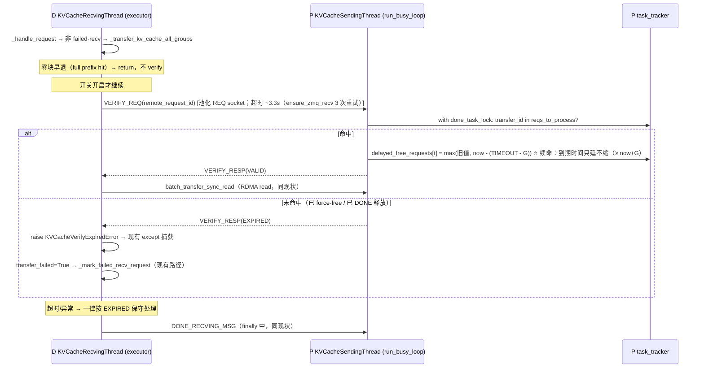

# VERIFY_REQ Phase 1 规格：D-pull 前控制面校验 + 验证续命

> 日期：2026-09-03
> 分支：`fix/verify_req_phase1`
> 关联 issue：[vllm-project/vllm-ascend#15420](https://github.com/vllm-project/vllm-ascend/issues/15420)
> 前置文档：[analysis_pd_disagg_kv_timeout_stale_read.md](../../analysis_pd_disagg_kv_timeout_stale_read.md)、
> [fix_proposals_pd_disagg_kv_stale_read.md](../../fix_proposals_pd_disagg_kv_stale_read.md)、
> [verify_req_implementation.md](../../verify_req_implementation.md)（前一版设计，本文在其基础上修正与收紧）

---

## 1. 背景

PD 分离（MooncakeConnectorV1，D-pull 架构）下：P 完成 prefill 后延迟释放 KV blocks，最长持有
`VLLM_MOONCAKE_ABORT_REQUEST_TIMEOUT`（默认 480s）；D 因排队未及时拉取时，P 超时 force-free，blocks
被新请求复用覆写；D 之后通过静态注册地址直接 RDMA read，读到脏数据 → 乱码。

根因：D-pull 数据面（RDMA read）与控制面（ZMQ）分离，P 在数据面无拦截能力，且释放与拉取之间没有任何校验屏障。

**已核实的修复基础**：D 侧 failed-recv → 重算的完整链路**已存在**（见 §5），本设计无需任何 scheduler 侧改动。

## 2. 已确认的决策（澄清记录）

| 决策点 | 结论 |
|--------|------|
| 修复范围 | 仅 Phase 1（VERIFY_REQ），心跳续租/容量上限留待 Phase 2 |
| Connector 范围 | 仅 MooncakeConnectorV1；Hybrid 同病另案处理；Layerwise 是 P-push 不受影响 |
| 发布开关 | 新增 env 开关，**默认关闭**（灰度：用户显式开启才生效） |
| 验收标准 | 白盒 UT 全绿 + 现有 UT 不回归；真实集群 E2E 由用户后续执行（手册见附录 A） |
| 实现方案 | **方案二：读前校验 + 验证续命（grace 下限，只延不缩）**（P 回 VALID 时执行 `max(旧值, now-(TIMEOUT-G))`：剩余窗口 < G 时顶到 G=10s，否则不动。竞态关闭条件"读 > max(剩余, G) ≥ G"现实不可达；不缩短原有窗口、不引入超出原 480s 语义的持有代价） |
| 评审优化 | 纳入：① 状态内聚 `check_and_extend`；② 可观测性三件套；③ 时钟注入竞态测试（见 §6/§8/§11）。否决与后续项见 §11 |

## 3. 目标 / 非目标

**目标**
1. D 发起 RDMA read 前通过 ZMQ 校验 P 侧 blocks 是否仍被持有；未持有则跳过读、走 failed-recv → 重算，杜绝脏数据被 decode 消费。
2. 消除"verify VALID 之后、读完成之前被 force-free"的竞态窗口（验证续命）。
3. 开关默认关闭时生产代码路径与现状完全一致。

**非目标**
- 不改变 D-pull 架构、不改变 480s 固定超时（HBM 占用效率问题留待 Phase 2 心跳续租）
- 不覆盖 MooncakeHybridConnector（同类问题另案）
- 不覆盖"P 新 + D 旧"版本错位（旧 D 不发 VERIFY，行为同现状；完整保护需两侧升级，D 新 + P 旧的安全降级见 §7）

## 4. 协议与架构

### 4.1 消息

沿用现有 msgspec msgpack 编码 + REQ/ROUTER 模式（与 `DONE_RECVING_MSG` 同构）：

```python
VERIFY_REQ_MSG = b"verify_req_msg"    # D → P: (VERIFY_REQ_MSG, transfer_id)
VERIFY_RESP_MSG = b"verify_resp_msg"  # P → D: (VERIFY_RESP_MSG, status)  status ∈ b"VALID" | b"EXPIRED"
```

### 4.2 时序



### 4.3 有效性判定（关键简化）

只查 `task_tracker.reqs_to_process`。依据已核实的不变量：
`add_delayed_request`（L215）仅在请求已属于 `reqs_to_process` 时将其加入 `delayed_free_requests`，
且两条移除路径（`update_done_task_count` L187、`_retrieve_expired_requests` L221）都同时清理两者，
故 `delayed_free_requests ⊆ reqs_to_process` 恒成立。
单集合检查等价于前一版设计的"两者取并集"，且额外覆盖"已开始处理、尚未进入延迟释放"的窗口。

**ID 等同性**（判定成立的前提）：D 侧 `req_meta["remote_request_id"]` 就是 P 侧的 `request_id`——
它由 P 的 `request_finished` 写入 `kv_transfer_params["remote_request_id"]`（mooncake_connector.py L1916：`remote_request_id=request.request_id`），
经 router 原样传递到 D 并随 `add_request` 进入 `req_meta`。P 侧直接用收到的 transfer_id 查自己的
`reqs_to_process`，无需任何转换。

### 4.4 验证续命（grace 下限，只延不缩）的正确性论证

- force-free 的**唯一**触发点是 worker 侧 `_retrieve_expired_requests` 的
  `now - delay_start_time > VLLM_MOONCAKE_ABORT_REQUEST_TIMEOUT`（已核实 scheduler 侧 `_reqs_need_send`
  仅是 request_finished → build_connector_meta 的交接缓冲，无独立超时逻辑）。
- **续命机制（max 下限规则）**：P 回 VALID 时执行
  `delayed_free_requests[t] = max(旧值, now - (TIMEOUT - G))`（`G = VERIFY_GRACE_SECONDS = 10s` 模块常量）。
  等价于到期时间 `expiry' = max(原到期时间, now + G)`——**窗口只延不缩**：
  剩余窗口 < G（压边界的过载场景，正是本 bug 人群）时顶到 G；剩余窗口 ≥ G（正常提前拉取）时值不动、
  甚至不发生写操作。
- **为什么这是最优点**：
  - 竞态关闭条件变为"读 > max(verify 时剩余窗口, G) ≥ G"——RDMA 读单请求最多几百 ms，G=10s 裕量
    20–100 倍，现实不可触发；
  - 对提前拉取的请求**绝不缩短**其原有窗口（"回拨到恰好 G"会把还剩 450s 的请求过早压到 10s，
    若读+DONE 超过 10s 会重新引入竞态——已否决）；
  - 死 D 的持有代价与现有 480s 语义**完全一致**，续命不引入任何超出原行为的持有延长（全额重置 480s
    过配已否决）。
- 另一条释放路径 DONE_RECVING 只由 D 在读完成后的 `finally` 中发送，不可能先于读触发。
- 结论："VALID → 读完成"期间两条释放路径均不可达，脏读窗口归零。
- Phase 2 衔接：心跳续租落地后，续命与心跳合用同一条 max 规则（Nixl 式"只增不减"），
  verify 保留"读前最后一问"的兜底角色，本行代码被 lease 机制自然吸收。
- 续命是 dict 值更新，不改变 OrderedDict 插入顺序。已知边界效应：被续命的条目若滞留到 grace 耗尽，
  会遮挡其后已过期条目的 force-free 直至该条目被移除——最坏 G=10s；正常流程 DONE 毫秒级到达，
  遮挡窗口可忽略。
- 存在性守卫：续命只对已在 `delayed_free_requests` 中的条目改值，不凭空创建条目
  （"在 `reqs_to_process` 但尚未进入延迟释放"的请求本就不可能被 force-free，无需续命）。

### 4.5 verify 的位置：`_transfer_kv_cache_all_groups` 内部（与前一版设计不同）

`_transfer_kv_cache_all_groups`（L774）是 `_handle_request` 中传输逻辑的唯一调用点（L721）：

- verify 插在**零块早退之后、构建 src/dst 列表之前**——full prefix hit（`num_local_blocks == 0`）不发起读、
  无脏读可能，自然跳过 verify，不多付一次 RTT；
- 校验失败 `raise KVCacheVerifyExpiredError`，落入现有 `except Exception` → `transfer_failed = True` →
  `_mark_failed_recv_request(...)`——与传输失败逐字复用同一条清理路径，不新增分支、不复制零块判断逻辑；
  （实现评审裁定：except 内对日志函数做 isinstance 特判——`KVCacheVerifyExpiredError` 记 WARNING 无栈
  （预期恢复路径，积压场景高频），其他异常保持 `logger.exception`；清理路径逻辑零变化）
- 专用异常类型使日志与测试可区分"P 侧已过期"与"传输异常"。
- 一次请求的全部 RDMA read 发往同一个 P 端点 session（`session_id = remote_host:remote_transfer_port`，
  一次 `batch_transfer_sync_read`，L962；已核实），verify 发往 `req_meta` 的
  `(remote_host, remote_handshake_port)` 即可，与 DONE_RECVING 寻址方式一致。

## 5. 失败路径数据流（全部为现有机制，零改动，已逐环验证）

```
_mark_failed_recv_request(request_id, local_block_ids)      # mooncake_connector.py L613，标记 invalid_block_ids
  → get_and_clear_invalid_block_ids()                        # L602 / L2494 get_block_ids_with_load_errors
  → KVConnectorModelRunnerMixin._get_kv_connector_output     # vllm kv_connector_model_runner_mixin.py L105
  → Scheduler.update_from_output → _handle_invalid_blocks    # vllm scheduler.py L1358→L2353
  → 默认策略 recompute_kv_load_failures=True（scheduler.py L121）
  → WAITING_FOR_REMOTE_KVS 请求：_update_requests_with_invalid_blocks 截断 num_computed_tokens
  → failed_recving_kv_req_ids → _update_waiting_for_remote_kv（L2154）
  → 请求回到 WAITING → 重算（脏数据永不被 decode 消费）
```

NPU 侧 `NPUModelRunner(GPUModelRunner)` 继承链使用该 mixin，传播链在 vllm-ascend 上成立。

## 6. 代码改动清单

全部在 `vllm_ascend/distributed/kv_transfer/kv_p2p/mooncake_connector.py`，另加 `vllm_ascend/envs.py` 一行。

| # | 位置 | 改动 |
|---|------|------|
| 1 | `vllm_ascend/envs.py` | 新增 `VLLM_ASCEND_VERIFY_KV_BEFORE_PULL`（bool，默认 `False`）。命名用 vllm-ascend 自己的 `VLLM_ASCEND_` 前缀，不占用上游 vllm 的 `VLLM_MOONCAKE_` 命名空间 |
| 2 | 模块顶部常量区 | `VERIFY_REQ_MSG` / `VERIFY_RESP_MSG`；`VERIFY_GRACE_SECONDS = 10`（模块常量）；`class KVCacheVerifyExpiredError(Exception)` |
| 3 | `KVCacheRecvingThread.__init__` | `self.verify_before_pull_enabled = envs.VLLM_ASCEND_VERIFY_KV_BEFORE_PULL`（进程内不变，热路径不取 env） |
| 4 | `KVCacheTaskTracker` 新增 | `check_and_extend(request_id) -> bool`：持 `done_task_lock` 查 `reqs_to_process`；仅当条目已在 `delayed_free_requests` 时执行 max 下限续命（`max(旧值, time.time() - (VLLM_MOONCAKE_ABORT_REQUEST_TIMEOUT - VERIFY_GRACE_SECONDS))`，不凭空创建、只延不缩）；返回有效性。**判定与续命逻辑与状态、锁同住 tracker**——Hybrid connector 同构复用时是搬运而非重设计，单测直进现有 `TestKVCacheTaskTracker` 基建 |
| 5 | `KVCacheSendingThread.run_busy_loop` | if-elif 链新增 `VERIFY_REQ_MSG` 分支（无条件处理，不受开关控制——被动应答无害）：**仅做消息解码 → `task_tracker.check_and_extend(transfer_id)` → 编码回包**；payload 解码异常仅记日志不崩溃 |
| 6 | `KVCacheRecvingThread` 新增 | `_verify_remote_blocks_held(req_meta) -> bool`：`_get_remote_socket` 池化 REQ socket（同 `_send_done_recv_signal` L1401 模式）→ send/recv → `_return_remote_socket`；**任何超时/异常返回 False，且 close socket 不归还池**（沿用 L1427-1431 纪律——防止迟到应答滞留队列后被复用串味，配合 REQ 状态机保证"假 VALID"不可达，见 §10.4） |
| 7 | `_transfer_kv_cache_all_groups` | 零块早退（L789-790）之后插入：`if self.verify_before_pull_enabled and not self._verify_remote_blocks_held(req_meta): raise KVCacheVerifyExpiredError(...)` |
| 8 | 可观测性 | D 侧 `KVCacheRecvingThread`：verify 结果计数器（valid/expired/timeout，线程安全）+ 分类日志（VALID→debug；EXPIRED→warning 含 remote_host/remote_request_id；TIMEOUT→warning 并提示"疑似老版本 P 或网络故障"）+ 60s 周期汇总日志（不接入 vllm KVConnectorStats，V1 未实现该机制）。P 侧 `KVCacheTaskTracker`：`recently_force_freed` 短期集合——`_retrieve_expired_requests` 弹出时记入（带时间戳，定期清理）；`update_done_task_count` 命中则降级 debug 并标注"force-free 后的迟到 DONE"，消除 EXPIRED 场景的预期 warning 刷屏 |
| 9 | `tests/ut/kv_offload/test_mooncake_connector.py` | 新增 `TestVerifyReq(unittest.TestCase)`（见 §8） |

生产代码净增约 60–80 行，无接口签名变更，单文件单点功能。

## 7. 开关与版本错位降级

| 场景 | 行为 |
|------|------|
| 开关关闭（默认） | `verify_before_pull_enabled=False` 短路，代码路径与现状一致 |
| D 新 + P 旧 | 老 P 的 `run_busy_loop` 落入 else 分支不回包 → D REQ 超时（`ensure_zmq_recv` 3 次重试 × 1s RCVTIMEO ≈ 3.3s）→ 按 EXPIRED → 重算（安全，浪费一次 prefill） |
| P 新 + D 旧 | 旧 D 不发 VERIFY，行为同现状（非目标，见 §3） |
| P 侧处理 | 无条件启用（不改 P 侧行为直至 D 主动询问） |

## 8. 测试策略

新增 `TestVerifyReq(unittest.TestCase)`，追加到 `tests/ut/kv_offload/test_mooncake_connector.py`，
复用现有 mock 基础设施（`make_agent_metadata`、`MockVllmConfig` 等）。

| 组 | 用例 | 断言要点 |
|----|------|---------|
| P 侧判定 | `test_check_and_extend_valid` / `test_check_and_extend_after_force_free` / `test_check_and_extend_after_done` | `reqs_to_process` 命中→True；force-free / DONE 后→False；直测 `KVCacheTaskTracker` 方法 |
| P 侧续命 | `test_verify_extends_deadline` / **`test_grace_boundary_with_injected_clock`** | 剩余存活 = `max(原剩余, G)`：原剩余 < G 顶到 G；原剩余 ≥ G 值不变；存在性守卫；插入顺序不变。**时钟注入**：verify 后注入 fake `time.time()`，G-ε 调真实 `_retrieve_expired_requests()` 断言请求未被弹出，G+ε 断言被弹出——竞态关闭成为可回归测试 |
| P 侧消息 | `test_handle_verify_req_valid` / `test_handle_verify_req_expired` / `test_handle_verify_req_malformed` | mock socket；回包编码正确；畸形消息仅记日志；分支仅编解码 + 调 `check_and_extend` |
| P 侧降噪 | `test_done_after_force_free_is_debug` | force-free 记入 `recently_force_freed` 后，`update_done_task_count` 命中走 debug 级"force-free 后的迟到 DONE"并清除；未命中仍 warning |
| D 侧 verify | `test_verify_remote_blocks_held_valid` / `_expired` / `_timeout` / `_zmq_error` / `test_verify_error_closes_socket_not_returned` / `test_verify_counters` | mock `ensure_zmq_send/recv`；超时与异常一律 False；出错路径 `socket.close()` 被调用且 `_return_remote_socket` 未被调用（防串味纪律）；三类计数器各自递增 |
| D 侧集成 | `test_transfer_verify_pass_calls_read` / `test_transfer_verify_expired_raises` / `test_handle_request_expired_marks_failed` | 通过→`batch_transfer_sync_read` 被调用；EXPIRED→`KVCacheVerifyExpiredError`→`_mark_failed_recv_request` 被调用且读被跳过 |
| 开关 | `test_verify_disabled_by_default` / `test_verify_enabled_skips_when_zero_blocks` | 关闭时不发 verify；零块场景即使开启也不发 |
| ZMQ 往返 | `test_zmq_verify_roundtrip` | 真实 `ipc://` ROUTER/REQ 对内，端到端验证协议编解码 |

验收线：以上用例全绿 + `tests/ut/kv_offload/` 现有用例不回归。

测试惯例注记（实现期实证）：本 connector 的 logger 是 vllm 共享 logger（`from vllm.logger import logger`，
实际名 `"vllm.logger"`、传播至 `"vllm"`）——`assertLogs` 目标应为 `"vllm"`（仓库惯例，见
`tests/ut/test_platform.py`），模块 `__name__` 路径的 logger 永不触发。

## 9. 边界情况

| 场景 | 行为 |
|------|------|
| verify 通过后、读完成前 P force-free | 续命保证剩余窗口 ≥ G=10s（只延不缩），force-free 最早在 verify 后 G 秒——读是毫秒级，不可达；DONE 路径在读完成后——竞态归零 |
| P 无响应 / ZMQ 异常 | D 保守按 EXPIRED → 重算。verify 处理是 O(1) 字典查询，P 忙致超时的概率与现有 DONE_RECVING 超时同级 |
| verify 与正常释放（DONE）并发 | DONE 时请求已从 `reqs_to_process` 移除 → verify 返回 EXPIRED；时序上 D 不会先 DONE 再 verify，不冲突 |
| 多 D TP rank 拉同一请求 | 每 rank 独立 verify 各自的 P 对端（与各自读的地址一一对应），互不影响 |
| transfer_failed 已置位 | 走现有 failed-recv 分支，短路，不会到达 verify |
| P 侧消息竞争（run_busy_loop vs 主线程轮询） | `done_task_lock` 串行化，与现有 `update_done_task_count` 并发方式一致，无新锁 |

## 10. 风险

1. **ZMQ round-trip 开销与路径归属**：verify **不是新路径**——复用现有控制面连接（D 侧既有 `remote_sockets` socket 池，与 DONE_RECVING 同池同端口；P 侧 `run_busy_loop` 的 ROUTER 多一个分支），无新端口/新连接；D 侧在 recv 线程的 executor worker 执行、P 侧在专职 sending 线程处理，**主 forward 循环零参与**（请求此时处于 `WAITING_FOR_REMOTE_KVS`，本不参与 forward）；RDMA 数据面零参与。每次实际拉取 +1 RTT（约 100μs–1ms），相对 RDMA 传输的几十 ms 可忽略；零块场景与开关关闭场景零开销。共享资源：`done_task_lock` 临界区 O(1) 与现有 DONE 处理同级；ROUTER 每拉取多 ~50B 消息，对比现有流量（GET_META 几百 KB、DONE+ACK）可忽略。与 DONE_RECVING 的本质区别：DONE 是**结果信号**，其效果按设计必然落在主 IO（P 侧触发 scheduler `_free_blocks`、D 侧解锁 WAITING_FOR_REMOTE_KVS）；VERIFY 是**查询信号**，不产生任何 scheduler 可见的新状态，对主 IO 的唯一间接触点是上述锁竞争。
2. **保守失败引发重算**：P 短暂繁忙 → verify 超时 → 无谓重算。概率与现有 DONE_RECVING 超时同级，且开关默认关闭，灰度期可观测。
3. **P 不回包时的 executor 占用**：`ensure_zmq_recv` 内部 3 次重试（1s RCVTIMEO + 0.1s sleep），P 不回包时一个 executor worker（共 32）和池中一个 socket 最长被占 **~3.3s**——与现有 DONE_RECVING 等待 ACK 同模式（同 helper 同超时），仅每请求多一次。极端情况下大量 stale 请求并发 verify 超时会挤占 executor 池，拖慢其他请求的 KV 拉取；灰度期观测点，默认关闭兜底。
4. **ZMQ 可靠性的失败方向单一**：所有 ZMQ 故障（超时/断连/消息损坏/sending 线程死亡/控制面分区）都收敛到 `verify=False → 跳过读 → 重算`——故障只造成"多算"，不造成"脏读"。假 VALID 不可达，三重保障：① VALID 只在 P 真实持有时发出（持锁查询，回答时刻为真）；② 续命保证 VALID 后剩余窗口 ≥ G=10s；③ REQ 状态机（超时后必须先 recv 才能 send，否则 EFSM 报错）+ 出错即 close 不归还池的纪律，杜绝迟到应答滞留队列后被复用串味。
5. **开关即回滚**：异常情况关闭 env 即恢复现状，无需回滚 patch。

## 11. 优化点决策记录（2026-09-03 评审）

**纳入（已并入 §6/§8）**：① 状态内聚——判定+续命下沉为 `KVCacheTaskTracker.check_and_extend`（状态与锁同住，
Hybrid 同构复用是搬运而非重设计，单测直进 `TestKVCacheTaskTracker`）；② 可观测性三件套（D 侧三类结果
分类日志 + 计数器 + 60s 汇总；P 侧 `recently_force_freed` 降噪）；③ 时钟注入竞态测试
（G±ε 两个时刻确定性断言，竞态关闭从推理论证变为可回归测试）。

**否决（记录理由）**：

| 想法 | 否决理由 |
|------|---------|
| 批量 verify（N 个积压请求合一条消息） | per-peer handler 串行处理，verify RTT 占单请求处理时长（几十 ms RDMA 读）<1%，过载收益微小，协议复杂度不值 |
| verify 超时后立即重试一次 | 阻塞 3.3s→6.6s，与"快速放弃去重算"矛盾——重算更快更稳 |
| D 侧 fast-path 越过 verify（用 kv_transfer_params 里 P 侧时间戳判断"肯定未过期"） | 跨机时钟偏差不可控，NTP 偏差可造成假 VALID |
| grace 值 env 化 | 10s 有 20–100 倍裕量；YAGNI，灰度反馈需要时再开 |
| verify 独立短超时（专用 socket 池 300ms×3） | 已评估：executor 占用 3.3s→0.9s 收益中等，需区分池实现；暂缓，灰度期 P 无响应率显著时再启用 |

**后续演进（不进 Phase 1）**：

- Phase 2 心跳合流：心跳续租与 `check_and_extend` 同一条 max-lease-floor 规则，调同一方法；
- Phase 2 通道：心跳首选 ADXL notify（持久 channel + 送达 ACK 现成，见附录 B），前提上游补 `send_notify` 绑定；
- Hybrid connector：tracker 同构，届时搬运 `check_and_extend` 即可；
- 远期：GET_META 应答带 epoch/validity token，把校验下沉到传输层（上游 NixlPush C1 方向）；
- E2E 观测补充：修复后重算使受影响请求 TTFT 变长（正确恢复的副作用），观测对比 TTFT 分布而非仅乱码率。

## 附录 A：E2E 验证手册（真实 PD 集群，非本次验收线）

1. **复现 bug**（开关关闭）：`VLLM_MOONCAKE_ABORT_REQUEST_TIMEOUT=10`，P/D 加压使 D 侧请求排队超过 10s，
   观察输出乱码 + P 侧 `Force freed expired request`（ERROR）。注：D 侧 `finish req not in reqs to process`
   已降噪为 debug（迟到 DONE 属预期路径），不再作为复现判据，以 P 侧 ERROR 与乱码为准。
2. **验证修复**（开关开启）：同上参数，预期 D 侧出现
   `KVCacheVerifyExpiredError` / EXPIRED warning（WARNING 级、无栈），scheduler 日志出现
   `Recovered from KV load failure: N request(s) rescheduled`，请求重算后输出正常，无乱码。
3. **判定标准**：乱码率降为 0；重算请求数与 D 侧排队超时请求数一致；P 侧无新增内存泄漏（blocks 仍按时释放）。

## 附录 B：HIXL/Mooncake notify 替代 ZMQ 的可行性调研（2026-09-03 实证，结论：可靠性同级，交互模型不匹配，Phase 1 维持 ZMQ）

调研对象：HIXL（~/code/cpp/hixl）、Mooncake 主分支与生产 wheel
`mooncake-transfer-engine-npu==0.3.11.post1`（binary strings 实证）。

### B.1 引擎分叉：两条 notify 实现，可靠性等级完全不同

`EngineFactory::CreateEngine` 按配置分叉；生产路径（Mooncake `AscendDirectTransport` → `hixl::Hixl`
`AutoConnect=1` → `CommEngine` → `AdxlInnerEngine`）走 **ADXL**，不走 fabric_mem。

| | fabric_mem 路径（`EnableFabricMem` 才启用） | ADXL 路径（生产） |
|---|---|---|
| 连接 | 每条 notify 新建 TCP（`CtrlMsgPlugin::Connect` 无缓存） | **持久 channel**（`channel_manager_.GetChannel`，AutoConnect 建链） |
| 投递保证 | fire-and-forget，服务端队列满静默丢弃 | **per-notify `req_id` + 阻塞等 ACK**（`notify_cv_.wait_for`），超时显式 TIMEOUT |
| 接收端背压 | 满则丢弃无感知 | 队列有界（`kMaxNotifyStorageSize=4096`），满则拒绝投递 → 无 ACK → 发送方超时（**显式背压**） |
| 探活 | 无 | channel 心跳（kHeartBeat）+ 错误断链重连（DisconnectOnError） |
| 顺序 | per-client FIFO | per-channel FIFO |

**结论修正**：此前"每条新建连接 + 静默丢弃"仅对 fabric_mem 成立；ADXL notify 是"带送达确认的单向消息"，
持久连接 + ACK + 有界背压 + 心跳探活，**可靠性不劣于 ZMQ**（背压模型比 ZMQ 的 TCP 缓冲堆积更明确）。

**为什么 fabric_mem 数据面性能更高、notify 反而更简陋**（两者不矛盾，是同一设计决策的两面）：
fabric_mem 为 A3 超节点内 D2RH/RH2D 高带宽传输而生（DRAM 统一编址 + VMM + SDMA 单边访问，
带宽从 RoCE ~20GB/s 提到百 GB/s 级，见 hixl docs/design/FabricMem模式设计.md），复杂度预算全在数据面；
其 notify 面向"极低频缓存池事件 + 上层可容忍丢失 + 常驻对端"假设，datagram 式（一次性连接即消息，
服务端处理完即 close fd）是合理取舍。ADXL 面向 PD 分离高频控制消息（丢失 = 请求级故障），
持久 channel + ACK + 背压是刚需。verify 属于"per-request、需答案、不可丢"，恰落在 ADXL 的假设域。

### B.2 verify 的缺口在交互模型（非可靠性）

notify = 单向 + 送达 ACK；verify 需要答案（request-response）。ADXL 下 verify 须拆两条 notify +
两侧 `GetNotifies` 轮询。三个行为差异（均非可靠性缺陷）：

1. 延迟模型：阻塞 RTT → 两个轮询周期 + 两次发送，轮询间隔成为新参数（小则烧 CPU，大则延迟）；
2. 消费耦合：P 消费停顿 → 队列涨至 4096 → 后续 verify 被显式拒绝 → D 超时 → 重算（安全方向，
   但 verify 延迟对消费节奏敏感）；
3. 失败方向与 ZMQ 一致：TIMEOUT/NOT_CONNECTED/channel 断 → D 按 EXPIRED → 重算，
   "多算不脏读"的单向失败性质不变。

### B.3 选型结论

- **Phase 1 维持 ZMQ**，理由更新为：① request-response 一次阻塞交互天然匹配 verify；
  ② 零轮询/零新线程/零新绑定；③ 老 P 降级行为明确（不回包 → ~3.3s 超时 → 重算）。
  可靠性不再是差异化因素。
- **生产 wheel 绑定现状**（0.3.11.post1，binary strings 实证）：pybind 暴露 `get_notifies` /
  `TransferNotify` / `send_probe`，**无独立 `send_notify`**（唯一 send 路径是
  `submitTransferWithNotify`，附着于真实传输）；C++ 层 `sendNotifyByName/ByID` 未绑定。
  采用 ADXL notify 需升级/自制 wheel 或新增绑定。
- **Phase 2 通道候选更新**：心跳恰是"单向 + 只需送达确认"的消息，ADXL notify（持久 channel + ACK +
  心跳探活现成）是比 ZMQ 更贴合的心跳通道，列为 Phase 2 首选候选（前提：解决 send_notify 绑定）。

### B.4 数据面切换 fabric_mem 的前瞻影响评估（2026-09-03）

Mooncake `AscendDirectTransport::allocateLocalSegmentID` 实证：fabric_mem 按 TE 角色显式隔离——
Store 路径 env 被 `ascend_store_te_init` 门控（"a P2P TE does not inherit it"）；P2P 需显式在
`ASCEND_GLOBAL_RESOURCE_CONFIG` 配 fabric_memory 才启用，可独立灰度。

- **对 Phase 1（本方案）：零影响，严格正交**。verify 全部组件（ZMQ 消息、tracker lease、force-free
  会计、失败→重算）在 connector 层，对数据面传输实现无感知；`batch_transfer_sync_read` API 两种模式不变。
  架构前提反而加固：SDMA 是比 RDMA read 更彻底的单边访问（对端零参与），verify 屏障依然必要；
  脏覆写来自新请求的 KV 计算写入（与传输方式无关）；池预注册下 force-free/复用发生在注册区域内部
  block 粒度，竞态窗口物理结构不变；读更快 → grace G=10s 裕量更大。
- **对 Phase 2：心跳通道假设被打破，需届时三选一**。P2P 切 fabric_mem 后同一 hixl 实例的 notify 退化为
  datagram 语义（每条新建连接、无 ACK、队列满静默丢弃），不适合心跳（心跳前提是"送达即续命"）。
  选项：(a) 心跳维持 ZMQ（与数据面无关，最稳）；(b) 推动 fabric_mem notify 加 ACK（上游需求）；
  (c) 数据面 fabric_mem + 控制面另建 ADXL 模式 hixl 实例（TE 角色隔离先例表明方向可行，需验证）。
  P2P 保持 ADXL/RoCE（现状）则 B.3 的 Phase 2 结论原样成立。
- **前瞻**：fabric_mem 的 SDMA 单边写使 P-push 架构成本下降（呼应上游 NixlPush C1）；若未来走 P-push，
  D-pull 脏读问题类整体消失，verify 退化为冗余保险——方案生命周期的自然终点。
- **场景澄清**：ascend_store（KV offload D2R）路径属 kv_pool/ucm_connector 一族，与 PD P2P connector
  独立且已被门控隔离，与本方案无关。
- 对旧文档 fix_proposals 的修正：其"通道选型"一节将 HIXL notify 概括为"每次新建连接，不适合心跳"，
  该结论仅适用 fabric_mem 路径，对生产 ADXL 路径不成立。
