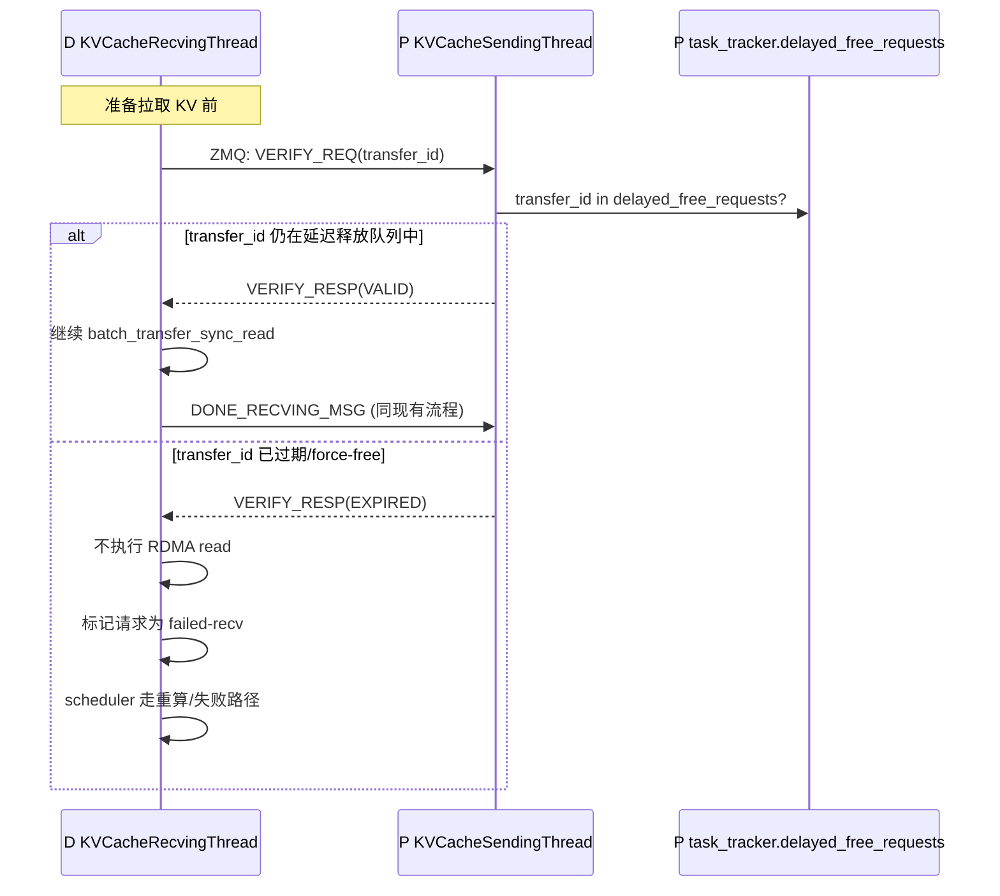
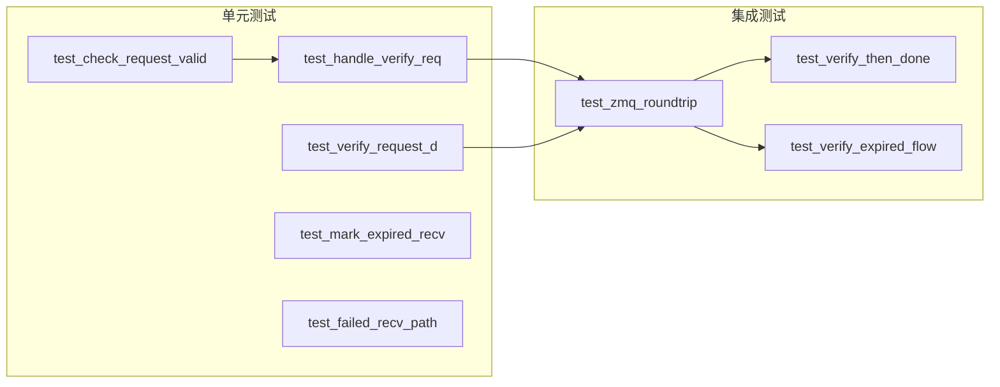

# VERIFY_REQ 实现设计文档（Phase 1）

> 分支：`fix/verify_req_phase1`
> 目标：在 D-pull 前增加控制面校验，防止 D 读取到已被 force-free 覆盖的脏 KV
> 关联：issue [#15420](https://github.com/vllm-project/vllm-ascend/issues/15420)
> 上游参考：NixlConnector lease renewal、NixlPush roadmap C1（validity token）

---

## 1. 设计目标

### 1.1 核心目标

在 D 节点执行 `batch_transfer_sync_read` 之前，通过 ZMQ 向 P 节点验证该请求的 KV blocks 是否仍有效（即未被 force-free）。若已过期，D 跳过 RDMA 读，走 failed-recv 路径，避免读到脏数据。

### 1.2 非目标

- 不改变 D-pull 架构
- 不改变现有 DONE_RECVING_MSG 释放路径
- 不引入心跳机制（Phase 2 再做）
- 不引入容量上限（Phase 2 再做）

---

## 2. 协议设计

### 2.1 消息格式

| 消息 | 方向 | Payload | 说明 |
|------|------|---------|------|
| `VERIFY_REQ_MSG` | D → P | `(VERIFY_REQ_MSG, transfer_id)` | 消息类型 1 字节 + transfer_id 字符串 |
| `VERIFY_RESP_MSG` | P → D | `(VERIFY_RESP_MSG, status)` | status = `VALID` 或 `EXPIRED` |

常量定义：
```python
VERIFY_REQ_MSG = b"verify_req_msg"
VERIFY_RESP_MSG = b"verify_resp_msg"
```

### 2.2 交互流程



### 2.3 有效性判定逻辑

P 侧检查 `transfer_id`（即 D 侧 `remote_request_id`，等于 P 侧 `request_id`）是否仍在 `KVCacheTaskTracker` 中：

**P 侧状态归属（已核实）**：

```python
# KVCacheTaskTracker (L166)
class KVCacheTaskTracker:
    def __init__(self):
        self.finished_requests: set[str] = set()
        self.delayed_free_requests: OrderedDict[str, float] = OrderedDict()  # L176: 延迟释放队列
        self.reqs_to_process: set[str] = set()  # L177: 正在处理的请求
```

- **`delayed_free_requests`**（L176）：key=request_id，value=delay_start_time。请求在 prefill 完成后被加入（`add_delayed_request` L215-219），表示"blocks 仍被 P 持有、延迟释放中"。
- **`reqs_to_process`**（L177）：正在跟踪的请求集合。
- **释放路径**（两个都会把它移除）：
  - 正常释放：`update_done_task_count` (L187-192) → `delayed_free_requests.pop` + `reqs_to_process.discard`
  - 超时 force-free：`_retrieve_expired_requests` (L221-241) → `delayed_free_requests.popitem` + `reqs_to_process.discard`

**注意**：`MooncakeConnectorScheduler._reqs_need_send`（L1660）是 scheduler 侧的延迟释放记录（`{request_id: delay_start_time}`），它通过 `build_connector_meta` (L1873) 传给 worker，worker 再转成 `KVCacheTaskTracker` 的状态。**P 侧 `KVCacheSendingThread` 自身没有 `reqs_need_send` 成员**——有效性判断必须查 `self.task_tracker`。

```python
def _check_request_valid(self, transfer_id: str) -> bool:
    """检查 transfer_id 是否仍被 P 持有（未 force-free、未正常释放）"""
    return transfer_id in self.task_tracker.delayed_free_requests
```

> 说明：`delayed_free_requests` 的 key 是 P 侧 `request_id`；D 侧 `req_meta["remote_request_id"]` 就是 P 侧 request_id（由 P 的 `request_finished` 返回的 `kv_transfer_params["remote_request_id"]` 传递而来，见 L1916），所以两侧 ID 一致，可以直接匹配。

> 备选：也可以查 `self.task_tracker.reqs_to_process`（包含尚未进入延迟释放队列的请求）。但 `delayed_free_requests` 语义更精确——它表示"blocks 正处于延迟释放保护中"。若请求已在 `reqs_to_process` 但尚未 `add_delayed_request`（极少见的时序窗口），此时 blocks 也未释放，查 `reqs_to_process` 更安全。**建议两者取并集**：`transfer_id in self.task_tracker.reqs_to_process or transfer_id in self.task_tracker.delayed_free_requests`，等价于"该请求的 blocks 尚未被释放"。

---

## 3. 代码改动

### 3.1 改动总览

| 文件 | 改动 | 位置 |
|------|------|------|
| `mooncake_connector.py` | 新增消息常量 | L81 附近 |
| `mooncake_connector.py` | P 侧 `run_busy_loop` 新增 `VERIFY_REQ_MSG` 分支 | L360 附近 |
| `mooncake_connector.py` | P 侧新增 `_handle_verify_req` 方法 | `KVCacheSendingThread` |
| `mooncake_connector.py` | D 侧 `_handle_request` 新增 verify 步骤 | L705 附近 |
| `mooncake_connector.py` | D 侧新增 `_verify_request` 方法 | `KVCacheRecvingThread` |
| `mooncake_connector.py` | D 侧新增 `_mark_expired_recv` 方法 | `KVCacheRecvingThread` |
| `tests/ut/kv_offload/test_mooncake_connector.py` | 新增 VERIFY_REQ 单元测试 | 新增文件或追加 |

### 3.2 P 侧改动详情

#### 3.2.1 新增消息常量（L81 附近）

```python
# 现有：
GET_META_MSG = b"get_meta_msg"
DONE_RECVING_MSG = b"done_recv_msg"

# 新增：
VERIFY_REQ_MSG = b"verify_req_msg"
VERIFY_RESP_MSG = b"verify_resp_msg"
```

#### 3.2.2 `run_busy_loop` 新增消息分支（L360 附近）

```python
# 在现有 if-elif 链中增加
elif msg[0] == VERIFY_REQ_MSG:
    request_id = msg[1].decode("utf-8")
    is_valid = self._check_request_valid(request_id)
    resp = VERIFY_RESP_MSG + (b"VALID" if is_valid else b"EXPIRED")
    sock.send_multipart((identity, b"", resp))
```

#### 3.2.3 `KVCacheSendingThread` 新增方法

```python
class KVCacheSendingThread(threading.Thread):
    # ... 现有代码 ...

    def _check_request_valid(self, transfer_id: str) -> bool:
        """检查 transfer_id 是否仍被 P 持有（未 force-free、未正常释放）
        
        通过检查 task_tracker 的延迟释放队列判断：
        - 在 delayed_free_requests 中 → 仍持有 blocks（VALID）
        - 不在 → 已被 force-free 或正常释放（EXPIRED）
        """
        return transfer_id in self.task_tracker.delayed_free_requests
```

### 3.3 D 侧改动详情

#### 3.3.1 `_handle_request` 新增 verify 步骤（L705 附近）

> **注意**：`_handle_request` 现有的 `finally` 块（L727-755）负责 `_mark_request_task_done`、`_send_done_signal_to_free_remote_port`、`_send_done_recv_signal` 等清理逻辑，**不能提前 return**。verify 应嵌入现有的 `if transfer_failed / else` 分支内，将"验证失败"归入 `transfer_failed = True` 的同一路径。

```python
def _handle_request(self, req_meta: dict[str, Any]):
    # ... 现有代码 ...
    transfer_failed = self._is_failed_recv_request(request_id)

    try:
        if transfer_failed:
            self._mark_failed_recv_request(request_id, req_meta["local_block_ids"])
            logger.warning("Skipping KV cache transfer for request. remote_request_id=%s. ", remote_request_id)
        else:
            # 新增：拉取前验证（Phase 1）
            if not self._verify_request(req_meta):
                transfer_failed = True
                self._mark_expired_recv(req_meta)  # 复用 _mark_failed_recv_request
                logger.warning(
                    "Request %s expired on P side, skipping KV read. remote_request_id=%s.",
                    request_id,
                    remote_request_id,
                )
            else:
                try:
                    self._transfer_kv_cache_all_groups(req_meta)
                except Exception as e:
                    transfer_failed = True
                    self._mark_failed_recv_request(request_id, req_meta["local_block_ids"])
                    logger.exception("Failed to transfer KV cache for request %s: %s", remote_request_id, e)
    finally:
        # ... 现有 finally 逻辑保持不变（L727-755）...
        pass
```

> 这样 verify 失败和传输失败走完全相同的清理路径（`_mark_request_task_done`、`_send_done_recv_signal` 等），无需新增提前 return 分支，改动最小且不破坏现有异常处理。

#### 3.3.2 `KVCacheRecvingThread` 新增方法

```python
class KVCacheRecvingThread(threading.Thread):
    # ... 现有代码 ...

    def _verify_request(self, req_meta: dict[str, Any]) -> bool:
        """拉取前验证请求是否仍有效"""
        remote_host = req_meta["remote_host"]
        remote_handshake_port = req_meta["remote_handshake_port"]
        transfer_id = req_meta.get("remote_request_id", "")

        sock = self._get_remote_socket(remote_host, remote_handshake_port)
        try:
            payload = self.encoder.encode((VERIFY_REQ_MSG, transfer_id))
            ensure_zmq_send(sock, payload, f"{remote_host}:{remote_handshake_port}")
            resp = ensure_zmq_recv(sock, f"{remote_host}:{remote_handshake_port}")
            return resp == b"VALID"
        except Exception as e:
            logger.error("VERIFY_REQ failed for request %s: %s", req_meta["request_id"], e)
            return False  # 验证失败时保守处理，不拉取
        finally:
            self._return_remote_socket(sock, remote_host, remote_handshake_port)

    def _mark_expired_recv(self, req_meta: dict[str, Any]):
        """标记请求为 expired（不拉取），走 failed-recv 路径"""
        request_id = req_meta["request_id"]
        # 标记本地 blocks 为无效，让 scheduler 走重算/失败路径
        self._mark_failed_recv_request(request_id, req_meta["local_block_ids"])
```

### 3.4 失败路径处理

D 侧收到 EXPIRED 后：

1. `_verify_request` 返回 `False`
2. `_handle_request` 调用 `_mark_expired_recv` → `_mark_failed_recv_request`，将本地 blocks 标记为无效
3. `update_done_task_count` 将请求加入 `finished_requests`
4. scheduler 轮询 `get_finished` → `done_recving` 中包含该请求
5. scheduler `_update_from_kv_xfer_finished` 处理 `finished_recving`：
   - 若请求状态为 `WAITING_FOR_REMOTE_KVS`：加入 `finished_recving_kv_req_ids`
   - 后续 scheduler 将请求移回 `WAITING` 状态，重新调度本地 prefill（重算）
6. 同时 `get_block_ids_with_load_errors` 返回被标记为无效的 blocks
7. `_update_requests_with_invalid_blocks` 处理无效 blocks，调整 `num_computed_tokens`

> **注意**：当前 `_update_requests_with_invalid_blocks` 是否在 EXPIRED 场景下走重算路径，需要验证。如果当前只处理传输失败导致的 block 无效，可能需要扩展以支持"验证失败"场景。

---

## 4. 白盒测试方案

### 4.1 测试架构



### 4.2 纯函数提取（便于单测）

将核心逻辑提取为纯函数，不依赖 ZMQ 或线程：

```python
# 在 KVCacheSendingThread 外部或作为静态方法
def check_request_valid(transfer_id: str, delayed_free_requests: dict) -> bool:
    """纯函数：检查 transfer_id 是否仍在延迟释放队列中"""
    return transfer_id in delayed_free_requests
```

测试用例针对 `delayed_free_requests`（OrderedDict）的各种状态：

### 4.3 测试用例清单

#### 4.3.1 P 侧 `_check_request_valid`

| 测试用例 | 输入 | 预期输出 | 说明 |
|---------|------|---------|------|
| `test_valid_request_in_need_send` | `transfer_id="req1"`, `delayed_free_requests={"req1": t}` | `True` | 请求仍在延迟释放队列（blocks 被持有） |
| `test_valid_request_not_in_need_send` | `transfer_id="req1"`, `delayed_free_requests={}` | `False` | 请求已被移除 |
| `test_valid_request_after_force_free` | `transfer_id="req1"`, `delayed_free_requests={}` | `False` | 模拟 force-free 后删除 |
| `test_valid_request_empty_string` | `transfer_id=""`, `delayed_free_requests={}` | `False` | 空字符串 |
| `test_valid_request_after_done` | `transfer_id="req1"`, `delayed_free_requests={"req2": t}` | `False` | 请求已被 DONE_RECVING_MSG 释放 |

**测试方法**：直接调用纯函数，无需 mock。

```python
def test_valid_request_in_need_send():
    delayed_free_requests = {"req1": time.time()}
    assert check_request_valid("req1", delayed_free_requests) is True

def test_valid_request_not_in_need_send():
    assert check_request_valid("req1", {}) is False
```

#### 4.3.2 P 侧 `run_busy_loop` 的 VERIFY_REQ 处理

| 测试用例 | 条件 | 预期行为 | 说明 |
|---------|------|---------|------|
| `test_handle_verify_req_valid` | mock socket，transfer_id 在 `task_tracker.delayed_free_requests` | `send_multipart` 被调用，payload 含 `VALID` | 验证消息正确编码 |
| `test_handle_verify_req_expired` | mock socket，transfer_id 不在 `task_tracker.delayed_free_requests` | `send_multipart` 被调用，payload 含 `EXPIRED` | 验证过期分支 |
| `test_handle_verify_req_malformed` | payload 格式错误（非 UTF-8 字符串） | 忽略或 log error | 异常处理 |

**测试方法**：使用 `@patch` mock `zmq.Socket`，构造 `KVCacheSendingThread` 实例并在 `task_tracker` 中设置 `delayed_free_requests`，直接调用 `_check_request_valid`。

```python
@patch("zmq.Socket")
def test_handle_verify_req_valid(mock_socket):
    thread = KVCacheSendingThread(...)
    thread.task_tracker.delayed_free_requests = {"req1": time.time()}
    identity = b"client_id"
    msg = (VERIFY_REQ_MSG, "req1")

    # 模拟框架调用
    result = thread._check_request_valid("req1")
    assert result is True
```

#### 4.3.3 D 侧 `_verify_request`

| 测试用例 | 条件 | 预期行为 | 说明 |
|---------|------|---------|------|
| `test_verify_request_valid` | P 返回 `VALID` | 返回 `True` | 正常验证通过 |
| `test_verify_request_expired` | P 返回 `EXPIRED` | 返回 `False` | 验证未通过 |
| `test_verify_request_timeout` | P 不响应，ZMQ 超时 | 返回 `False` | 异常处理 |
| `test_verify_request_zmq_error` | ZMQ 连接异常 | 返回 `False` | 异常处理 |

**测试方法**：mock `_get_remote_socket`, `ensure_zmq_send`, `ensure_zmq_recv`，构造 `KVCacheRecvingThread` 实例。

```python
@patch("vllm_ascend.distributed.kv_transfer.kv_p2p.mooncake_connector.ensure_zmq_send")
@patch("vllm_ascend.distributed.kv_transfer.kv_p2p.mooncake_connector.ensure_zmq_recv")
def test_verify_request_valid(mock_recv, mock_send):
    mock_recv.return_value = b"VALID"
    thread = KVCacheRecvingThread(...)
    req_meta = {"remote_host": "10.0.0.1", "remote_handshake_port": 12345, "remote_request_id": "req1"}
    result = thread._verify_request(req_meta)
    assert result is True
```

#### 4.3.4 D 侧 `_handle_request` 集成

| 测试用例 | 条件 | 预期行为 | 说明 |
|---------|------|---------|------|
| `test_handle_request_verify_valid_then_read` | `_verify_request` 返回 True | 继续执行 `_transfer_kv_cache_all_groups` | 验证通过后正常拉取 |
| `test_handle_request_verify_expired_skip_read` | `_verify_request` 返回 False | 跳过 `_transfer_kv_cache_all_groups`，调用 `_mark_expired_recv` | 验证失败后走失败路径 |
| `test_handle_request_verify_expired_update_done` | `_verify_request` 返回 False | `update_done_task_count` 被调用 | 确保 scheduler 知道请求已完成 |

**测试方法**：mock `_verify_request` 和 `_transfer_kv_cache_all_groups`，验证调用关系。

#### 4.3.5 失败路径 `_mark_expired_recv`

| 测试用例 | 条件 | 预期行为 | 说明 |
|---------|------|---------|------|
| `test_mark_expired_recv_calls_failed_recv` | `_mark_expired_recv` 被调用 | `_mark_failed_recv_request` 被调用，传递正确的参数 | 验证本地 blocks 被标记为无效 |
| `test_mark_expired_recv_clears_pending` | 请求有 pending reformat | `pending_reformat` 被清理 | 避免内存泄漏 |

#### 4.3.6 ZMQ 往返集成测试

| 测试用例 | 条件 | 预期行为 | 说明 |
|---------|------|---------|------|
| `test_zmq_verify_roundtrip` | 真实 ZMQ 连接（REQ/ROUTER 对内） | 发送 VERIFY_REQ 收到 VERIFY_RESP | 端到端验证协议 |
| `test_verify_then_done` | verify 通过后 DONE_RECVING_MSG | 正常释放流程 | 验证两个消息的配合 |
| `test_verify_expired_recovery` | verify 返回 EXPIRED → failed-recv | scheduler 重算或 abort | 验证完整错误路径 |

**测试方法**：在测试中创建 ZMQ 对内连接（`ipc://` 或 `tcp://127.0.0.1`），模拟 P 和 D 的 ZMQ 交互。

```python
def test_zmq_verify_roundtrip():
    ctx = zmq.Context()
    # P 侧 ROUTER
    p_sock = ctx.socket(zmq.ROUTER)
    p_sock.bind("tcp://127.0.0.1:0")
    port = p_sock.getsockopt(zmq.LAST_ENDPOINT)
    # D 侧 REQ
    d_sock = ctx.socket(zmq.REQ)
    d_sock.connect(port)
    # D 发送 VERIFY_REQ
    d_sock.send(encoder.encode((VERIFY_REQ_MSG, "req1")))
    # P 接收并处理
    identity, _, payload = p_sock.recv_multipart()
    msg = decoder.decode(payload)
    assert msg[0] == VERIFY_REQ_MSG
    # P 回复
    resp = b"VALID" if msg[1] in thread.task_tracker.delayed_free_requests else b"EXPIRED"
    p_sock.send_multipart((identity, b"", resp))
    # D 接收
    d_resp = d_sock.recv()
    assert d_resp == b"VALID"
```

### 4.4 测试框架要求

- 使用 `unittest.TestCase` + `pytest`（与现有测试一致）
- ZMQ 相关测试使用 `@patch` mock 或自建 `tcp://127.0.0.1` 对内连接
- `mooncake.engine.TransferEngine` 使用 `MagicMock`（与现有测试一致）
- 纯函数测试不需要 mock，直接调用

### 4.5 测试文件

新增或追加到 `tests/ut/kv_offload/test_mooncake_connector.py`。

推荐新增一个独立的测试类 `TestVerifyReq`：

```python
class TestVerifyReq(unittest.TestCase):
    """VERIFY_REQ 功能单元测试"""

    def setUp(self):
        # 设置 mock 环境（parallel groups、ascend_config 等）
        # 创建 KVCacheTaskTracker 实例
        # 创建 KVCacheSendingThread / KVCacheRecvingThread 实例（带 mock）

    def test_check_request_valid(self):
        ...

    def test_handle_verify_req_valid(self):
        ...

    def test_handle_verify_req_expired(self):
        ...

    def test_verify_request_d_valid(self):
        ...

    def test_verify_request_d_expired(self):
        ...

    def test_handle_request_verify_valid_then_read(self):
        ...

    def test_handle_request_verify_expired_skip_read(self):
        ...

    def test_zmq_verify_roundtrip(self):
        ...
```

---

## 5. 验收标准

| 场景 | 预期行为 | 验证方式 |
|------|---------|---------|
| D 拉取前请求仍有效（正常） | D 继续 RDMA read，正常拉取 KV | 单测验证 `_transfer_kv_cache_all_groups` 被调用 |
| D 拉取前请求已 force-free | D 跳过 RDMA read，标记 failed-recv | 单测验证 `_transfer_kv_cache_all_groups` 未被调用，`_mark_failed_recv_request` 被调用 |
| P 侧 ZMQ 不响应（网络异常） | D 保守地跳过 RDMA read（返回 False） | 单测验证超时/异常处理路径 |
| 多个 D 的 TP rank 同时验证 | 各自验证，互不影响 | 集成测试验证并发场景 |
| 验证通过后走正常 DONE_RECVING_MSG 释放 | P 侧收到 DONE_RECVING_MSG 后正常释放 blocks | 集成测试验证完整流程 |

---

## 6. 实施计划

| 步骤 | 内容 | 预估工时 |
|------|------|---------|
| 1 | 提取纯函数 + 实现 P 侧 `_check_request_valid` | 0.5 天 |
| 2 | 实现 P 侧 `run_busy_loop` VERIFY_REQ 分支 | 0.5 天 |
| 3 | 实现 D 侧 `_verify_request` | 0.5 天 |
| 4 | 实现 D 侧 `_handle_request` 验证步骤 + `_mark_expired_recv` | 0.5 天 |
| 5 | 白盒单测（6 个用例 + 集成测试） | 1 天 |
| 6 | 代码审查 + 修复反馈 | 0.5 天 |
| **合计** | | **3.5 天** |

---

## 7. 风险和注意事项

1. **ZMQ round-trip 对延迟的影响**：verify 在 RTT 上增加一个 ZMQ 往返（约 100μs–1ms），相对 RDMA 传输的几十 ms 可忽略。
2. **竞态条件**：VERIFY_REQ 和 RDMA read 之间 P 可能 force-free？但 force-free 后 `task_tracker.delayed_free_requests` 中已无该 `transfer_id`，verify 会返回 EXPIRED（安全）。
3. **`run_busy_loop` 和 `get_finished` 的并发**：两者在同一个 event loop 中串行执行，不存在竞争（`run_busy_loop` 的 if-elif 链处理 VERIFY_REQ，`fetch_finished_sending_reqs` 在同一线程中执行）。
4. **D 侧 `_verify_request` 异常安全**：任何异常（ZMQ 超时、连接错误、解码错误）都应返回 `False`，保守地不拉取 KV。